# AudioSheet — System Architecture Document

| Field | Value |
| --- | --- |
| Document ID | `AS-ARCH-001` |
| Version | `1.0.0` |
| Status | Normative / implementable |
| Audience | Autonomous coding agents and human engineers |
| Product | Offline desktop + offline-capable web tool that converts an uploaded `.mp3` / `.wav` file into playable sheet music and guitar tablature, with a three-position difficulty slider (`Simple`, `Medium`, `Complex`) |

---

## Reading Contract (normative preamble)

This document is a build specification, not a discussion. It is written so that an autonomous coding agent can implement the system without asking clarifying questions.

**Keyword semantics (RFC 2119):** `MUST`, `MUST NOT`, `SHALL`, `SHOULD`, `MAY`. Any statement without a keyword is descriptive context. Any numeric value in a table marked *Normative* is a hard-coded constant and MUST appear in code exactly once, in the module named in that table.

**Global invariants.** These hold at every stage boundary and MUST be enforced by runtime assertions in debug builds:

- **INV-1 (Offline).** No stage may open a network socket. All models, fonts, soundfonts, and binaries are vendored at build time. The runtime MUST fail closed if a model file is missing rather than attempting a download.
- **INV-2 (Determinism).** Given identical input bytes, identical model files, and identical `DifficultyProfile`, every stage MUST produce byte-identical output. All RNG is seeded from a constant (`AUDIOSHEET_SEED = 20240101`). Non-deterministic ML options (e.g. Demucs random-shift augmentation) are **disabled by default**.
- **INV-3 (Immutability + provenance).** Stages never mutate their input. Each stage emits a new document version and appends a `ProcessingStep` record. Every derived note carries `origin_ids` tracing back to raw transcription notes, so the UI can always answer "why is this note here?".
- **INV-4 (Single source of truth).** The `ScoreDocument` JSON (Section 3) is the only inter-stage contract. MIDI and MusicXML are **exports**, never intermediates. No stage may parse MusicXML to recover information it should have read from `ScoreDocument`.
- **INV-5 (Time is dual-encoded).** Every temporal value exists in both **seconds** (`float64`, source-of-truth for audio alignment) and **ticks** (`int32`, `PPQ = 960`, source-of-truth for notation). Conversion goes through `TempoMap` only — never by multiplying a single global BPM.
- **INV-6 (Difficulty is non-destructive).** Difficulty reduction is a *pure function* `reduce(ScoreDocument, DifficultyProfile) -> ScoreDocument`. The `Complex` document is always retained; `Simple` and `Medium` are recomputed on slider change. Moving the slider MUST NOT require re-running any ML model.
- **INV-7 (Latency budget).** Slider movement to re-rendered score MUST complete in ≤ 400 ms p95 for a 4-minute input on the reference machine (Appendix 5.6). This is why INV-6 exists.

**Glossary.**

| Term | Definition |
| --- | --- |
| Stem | An isolated instrument channel produced by source separation (`vocals`, `drums`, `bass`, `guitar`, `piano`, `other`). |
| Posteriorgram | Time × pitch matrix of per-frame probabilities emitted by a transcription model. |
| Note event | A quadruple (onset, offset, pitch, confidence) after peak-picking and thresholding a posteriorgram. |
| Grid | The quantized lattice of legal onset positions, derived from the beat track and the difficulty profile. |
| Voice | A monophonic melodic stream within a staff (MusicXML `<voice>`); at most one note sounding per voice per instant. |
| Voicing | A concrete assignment of a chord's pitches to physical positions — piano hand division, or guitar (string, fret) pairs. |
| Position (guitar) | The fret number under the index finger; a *position window* is `[position, position + span]`. |
| Salience | A scalar `[0,1]` ranking a note's musical importance; the core input to note reduction. |

**Non-goals (explicitly out of scope for v1.0).** Lyric transcription; real-time/streaming transcription of live input; multi-track mixing or audio editing; cloud sync; drum-kit *notation* beyond a reduced 5-line percussion staff; orchestral instrument classification beyond the six Demucs stems; music-theory pedagogy content; printing/PDF pipeline beyond browser print-to-PDF.

---

## 1. System Pipeline Overview

### 1.1 Topology

The system is a **nine-stage, single-direction pipeline**. Stages S0–S6 are the offline "analysis" half (expensive, run once per file, cached). Stages S7–S8 are the "presentation" half (cheap, re-run on every slider move).

```mermaid
flowchart TD
    A[User file .mp3/.wav] --> S0
    S0[S0 Ingestion &amp; Decode<br/>ffmpeg / libsndfile] --> S1
    S1[S1 Global Analysis<br/>tempo, beats, downbeats, key, meter] --> S2
    S0 --> S2
    S2[S2 Stem Isolation<br/>Demucs v4 htdemucs_6s] --> S3
    S2 --> S4
    S3[S3 Pitched Transcription<br/>basic-pitch / CREPE] --> S5
    S4[S4 Percussion Transcription<br/>onset CNN + kit classifier] --> S5
    S5[S5 Symbolic Consolidation<br/>quantize, spell, voice-split, chords] --> S6
    S6[S6 Canonical ScoreDocument<br/>difficulty=complex, ground truth] --> S7
    S6 --> CACHE[(Project cache<br/>.audiosheet/)]
    S7[S7 Difficulty Engine<br/>pure reduce&#40;&#41;] --> S8
    S8[S8 Renderers<br/>VexFlow / AlphaTab / MusicXML / MIDI] --> OUT[Interactive score + playback + export]
    SLIDER[Difficulty slider] -.re-runs.-> S7
```



### 1.2 Stage contracts

Each stage is a class implementing `Stage[TIn, TOut]` with `name`, `version`, `fingerprint(input) -> str`, and `run(input, ctx) -> TOut`. `fingerprint` is a BLAKE3 hash over `(input_hash, stage_version, relevant_config)` and is the cache key. A stage MUST be skippable when its fingerprint hits the cache.

| ID | Stage | Input | Output | Cacheable | Typical cost (4-min stereo, reference machine) |
| --- | --- | --- | --- | --- | --- |
| S0 | Ingestion & Decode | file bytes | `AudioBundle` (PCM at 3 sample rates) | yes | 1–3 s |
| S1 | Global Analysis | `AudioBundle` | `TimingGrid`, `KeyEstimate` | yes | 4–10 s |
| S2 | Stem Isolation | `AudioBundle` | `StemSet` (6 × PCM) | yes | 25–90 s |
| S3 | Pitched Transcription | `StemSet` | `RawNoteSet` per stem | yes | 15–40 s |
| S4 | Percussion Transcription | `StemSet.drums` | `RawDrumSet` | yes | 5–12 s |
| S5 | Symbolic Consolidation | S1 + S3 + S4 | `ScoreDocument@complex` | yes | 2–6 s |
| S6 | Canonicalization & Validation | `ScoreDocument` | validated `ScoreDocument` | yes | < 1 s |
| S7 | Difficulty Engine | `ScoreDocument` + profile | `ScoreDocument@level` | in-memory | 40–250 ms |
| S8 | Rendering & Export | `ScoreDocument@level` | DOM / MusicXML / MIDI | no | 60–200 ms |

### 1.3 S0 — Audio ingestion and decode

**Responsibilities:** validate, decode, normalize, and produce every sample-rate variant the downstream models require, exactly once.

1. **Validate container.** Accept `audio/mpeg` (`.mp3`) and `audio/wav` (`.wav`, PCM 8/16/24/32-bit int, 32/64-bit float). Sniff by magic bytes (`ID3`, `0xFFFB`/`0xFFF3`/`0xFFFA` frame sync for MP3; `RIFF....WAVE` for WAV) — **never** trust the file extension or the browser-supplied MIME type. Reject with `E_INGEST_FORMAT` otherwise.
2. **Enforce limits** (Normative, `core/config/limits.py`): max file size `120 MiB`; max duration `600 s`; min duration `1.0 s`; max channels `2` (>2 are downmixed with equal weights and a `W_INGEST_DOWNMIX` warning).
3. **Decode** to `float32` planar PCM via `ffmpeg` (vendored static binary, invoked with `-nostdin -hide_banner -vn -map 0:a:0`) or `libsndfile`/`soundfile` for WAV. MP3 decoding MUST strip the encoder delay/padding reported in the LAME/Xing header; if absent, trim a fixed `1105` samples at 44.1 kHz and record `ingest.trim_samples` so all later timestamps stay aligned to the perceived audio.
4. **Resample** with a polyphase SoX-quality resampler (`soxr` VHQ, or `torchaudio.functional.resample` with `lowpass_filter_width=64`) into three fixed variants. Resampling MUST be done once here; no downstream stage may resample.

    | Variant | Rate | Channels | Consumer | Normative |
    | --- | --- | --- | --- | --- |
    | `pcm_44k_stereo` | 44100 Hz | 2 | Demucs (S2), waveform display | ✔ |
    | `pcm_22k_mono` | 22050 Hz | 1 | basic-pitch (S3) | ✔ |
    | `pcm_16k_mono` | 16000 Hz | 1 | CREPE (S3), beat tracker (S1) | ✔ |

5. **Normalize loudness** to `-18.0 LUFS` integrated (ITU-R BS.1770-4) with true-peak limiting at `-1.0 dBTP`. Store the applied gain in `ingest.gain_db`; **do not** apply gain to the copy used for waveform display. Silence at head/tail below `-60 dBFS` for > 250 ms is detected and recorded as `ingest.leading_silence_s` but **not** trimmed (trimming would desynchronize user playback).
6. **Emit `AudioBundle`.** Fields: `sha256` of original bytes, `duration_s`, `source_sample_rate`, `channels`, the three PCM variants (memory-mapped `.npy` in the project cache, never held twice in RAM), `gain_db`, `trim_samples`, `leading_silence_s`, `warnings[]`.

**Failure policy.** Corrupt frames mid-file: decode as far as possible, zero-fill gaps < 500 ms, and abort with `E_INGEST_DECODE` if total corrupt span > 2 % of duration.

### 1.4 S1 — Global musical analysis (tempo, beats, downbeats, key, meter)

This stage runs on the **full mix**, not on stems: separation artifacts degrade beat tracking, while the mix carries the strongest rhythmic evidence.

**S1.1 Beat and downbeat tracking.** Primary: a joint beat/downbeat RNN+DBN — `madmom.features.downbeats.RNNDownBeatProcessor` followed by `DBNDownBeatTrackingProcessor(beats_per_bar=[2,3,4,6], fps=100, min_bpm=45, max_bpm=215)`. Preferred modern alternative if vendorable as ONNX: a transformer beat tracker (`beat_this`-class model) with the same DBN post-processor. Fallback (must always be present so the pipeline cannot hard-fail): `librosa.beat.beat_track(sr=16000, hop_length=512, trim=False)` plus a downbeat heuristic that picks the beat phase maximizing summed spectral-flux novelty at the candidate bar starts.

Output: `beats: [{time_s, beat_in_bar, confidence}]`, `downbeats: [time_s]`.

**S1.2 Tempo map construction.** Convert the beat list to a piecewise-constant `TempoMap`:

1. Compute inter-beat intervals `ibi[i] = beats[i+1].time_s - beats[i].time_s`; instantaneous BPM `= 60 / ibi[i]`.
2. Apply a median filter (window `5` beats) to suppress single-beat jitter.
3. Segment with a 1-D total-variation / PELT change-point detector; emit a new tempo event only when the segment mean differs from the previous by `> 2.0 %` **and** the new segment spans `≥ 2` bars. This prevents the "one tempo marking per bar" disease that makes scores unreadable.
4. Detect octave errors: if the median BPM `< 60` and the onset-density autocorrelation peaks at half the IBI, double the tempo (and vice versa above `190`). Record `timing.tempo_octave_corrected`.
5. Anchor `tick 0` to the **first downbeat**, not to `t = 0`. Audio before the first downbeat becomes a pickup (anacrusis) measure with `implicit = true`.

**S1.3 Meter estimation.** Score candidate meters `{4/4, 3/4, 2/4, 6/8, 12/8, 5/4, 7/8}` by (a) DBN downbeat likelihood, (b) autocorrelation of the onset novelty curve at bar-length lags, (c) beat-level accent periodicity. Pick the argmax; require a margin of `≥ 0.10` over the runner-up, otherwise default to `4/4` and set `timing.meter_confidence` low so the UI can offer a manual override. **Compound-vs-simple disambiguation:** if the dominant sub-beat subdivision ratio is `3` (triple subdivision) and beats-per-bar is `2` or `4`, prefer `6/8` / `12/8`.

**S1.4 Swing detection.** Build a histogram of off-beat onset phases within each beat (phase ∈ `[0,1)`). If the histogram's principal off-beat mode sits at `0.58–0.72` with ≥ `0.15` of total mass, set `timing.swing = {enabled: true, ratio: <mode>/(1-<mode>)}`. Swing is used by the quantizer (Section 2.1.3) so that swung eighths are notated as plain eighths with a "swing" directive rather than as unreadable triplet chains.

**S1.5 Key and mode estimation.** Compute a beat-synchronous chroma (CQT-based, 12 bins, log-frequency, per-beat median-pooled). Correlate against Krumhansl–Schmuckler / Temperley–Kostka–Payne major and minor profiles for all 24 keys. Additionally run a **windowed** pass (16-bar Hann window, hop 4 bars) to produce `key_regions[]` so modulations are captured. Output `KeyEstimate {tonic_pc, mode, confidence, regions[]}`. This feeds pitch spelling (S5.3) and difficulty transposition (Section 2.1.6).

### 1.5 S2 — Stem isolation

**Model:** Demucs v4 Hybrid Transformer — `htdemucs_6s` (6 stems: `drums`, `bass`, `other`, `vocals`, `guitar`, `piano`) as the default because guitar/piano separation materially improves tab quality. `htdemucs` (4 stems) is the fallback for low-memory machines, where `guitar` and `piano` collapse into `other`.

**Execution (Normative, `dsp/separation/demucs_runner.py`):**

| Parameter | Value | Rationale |
| --- | --- | --- |
| Input rate / channels | 44100 Hz stereo | Model's native training format |
| `segment` | 7.8 s | Native window; larger risks VRAM/RAM blow-up |
| `overlap` | 0.25 | Cross-fade between windows; removes seam clicks |
| `shifts` | 0 | **MUST be 0** — random-shift averaging violates INV-2 |
| `split` | true | Chunked inference, bounded memory |
| Device order | `cuda` → `mps` → `cpu` | Auto-detect; record chosen device in provenance |
| Precision | fp32 on CPU, fp16 permitted on CUDA | fp16 on CPU degrades quality with no speed gain |

**Post-separation processing.**

1. **Energy gating.** Compute each stem's integrated loudness. If a stem is `> 32 dB` below the loudest stem, mark it `present = false` and skip its transcription entirely. This is the single largest end-to-end speedup: a solo-piano recording skips four stems.
2. **Bleed suppression.** For each stem pair, if the spectral coherence in a band exceeds `0.85` and one stem dominates by `> 12 dB`, apply a soft spectral mask to the weaker stem. Bounded to at most `-6 dB` attenuation so we never invent silence.
3. **Persist** stems as 16-bit `.flac` (lossless, ~50 % of WAV) in the cache; keep the PCM variant each downstream model needs (Section 1.6 table) resampled once, here.

**Progress reporting.** Demucs dominates wall-clock; it MUST emit progress at ≥ 2 Hz derived from `chunks_done / chunks_total`, or the UI will look frozen.

### 1.6 S3 — Polyphonic and monophonic pitch detection

Model choice is **per-stem**, because monophonic stems get dramatically better results from a dedicated f0 tracker than from a polyphonic model.

| Stem | Model | Rate | Why |
| --- | --- | --- | --- |
| `piano`, `other`, `guitar` | **basic-pitch** (Spotify, ICASSP 2022) | 22050 Hz mono | Lightweight polyphonic, instrument-agnostic, note+onset+contour heads, Apache-2.0, tiny (~17 MB) |
| `bass` | **CREPE** (`full`) + monophonic note segmenter | 16000 Hz mono | Bass is monophonic ≥ 95 % of the time; CREPE's 20-cent resolution beats basic-pitch in the low register where basic-pitch degrades |
| `vocals` | **CREPE** (`full`) + segmenter | 16000 Hz mono | Continuous f0 with vibrato/portamento; needed for melody-line extraction |
| `guitar` (optional refinement) | tablature-aware CNN (`TabCNN` / `FretNet` class) | 22050 Hz mono | Predicts (string, fret) directly; when available its output *seeds* Section 2.3's optimizer instead of replacing it |
| `drums` | see S4 | — | Unpitched |

**S3.1 basic-pitch invocation.** The model consumes harmonically-stacked CQT-like features and emits three posteriorgrams: `Yo` (onsets), `Yn` (note activations, 88 bins spanning MIDI 21–108), `Yp` (pitch contours, 3 bins per semitone for sub-semitone f0). Frame hop is `256` samples at `22050 Hz` → frame rate `86.13 Hz` → **11.61 ms per frame**. This is the system's transcription time resolution and MUST be recorded in provenance.

Decoding parameters (Normative, `dsp/transcription/basic_pitch_params.py`) — per-stem overrides:

| Stem | `onset_threshold` | `frame_threshold` | `min_note_len_ms` | `min_freq_hz` | `max_freq_hz` | `melodia_trick` | `multiple_pitch_bends` |
| --- | --- | --- | --- | --- | --- | --- | --- |
| default | 0.50 | 0.30 | 127.70 | — | — | true | false |
| `piano` | 0.50 | 0.30 | 90.00 | 27.5 | 4186.0 | true | false |
| `guitar` | 0.45 | 0.28 | 80.00 | 73.4 | 1318.5 | true | false |
| `other` | 0.55 | 0.35 | 127.70 | 55.0 | 2093.0 | true | false |

`min_freq_hz` for `guitar` is D2 (73.4 Hz) rather than E2, to admit drop-D tunings. `max_freq_hz` 1318.5 Hz is E6, fret 24 on the high E string.

**S3.2 CREPE invocation.** Input `16 kHz` mono, hop `10 ms`, output a `360`-bin cents activation (`20`-cent resolution) plus per-frame confidence. Decode with Viterbi smoothing over the cents axis (transition penalty proportional to `|Δcents|`), then convert to notes:

1. Discard frames with `confidence < 0.50` (`< 0.35` for `bass`, whose low partials reduce model confidence).
2. Segment on (a) confidence gaps `> 40 ms`, or (b) a smoothed pitch jump `> 80 cents` sustained for `≥ 3` frames.
3. Reject segments shorter than `60 ms`.
4. Note pitch = **median** cents over the segment's central 60 % (excludes attack scoops and release falls), rounded to nearest semitone; retain the residual in `micro_cents` for bend/vibrato detection.
5. Vibrato detection: FFT the detrended cents track; if a `4–8 Hz` component exceeds `25` cents peak-to-peak, tag `articulations: ["vibrato"]`.

**S3.3 Per-stem post-processing (applies to all pitched stems).**

1. **Onset refinement.** Snap each model onset to the nearest peak of a high-resolution spectral-flux novelty curve (hop `128` @ `44.1 kHz` ≈ `2.9 ms`) within a `±30 ms` search window. This recovers precision that the 11.61 ms model hop discards and measurably improves quantization accuracy.
2. **Repeated-note splitting.** If a sustained note's `Yo` onset probability shows a local peak `> 0.5` more than `100 ms` after its own onset, split it into two notes (this is basic-pitch's known weakness on tremolo and re-articulated notes).
3. **Octave-error correction.** For each note, compare the energy at `f0/2` and `2·f0` in the stem's spectrogram over the note's span. If the sub-octave carries `> 6 dB` more energy and a note is not already present there, transpose down an octave. Log every correction.
4. **Duplicate/overlap resolution.** Two notes of identical pitch overlapping by `> 50 %` are merged (union span, max confidence). Overlap `≤ 50 %` truncates the earlier note's offset to the later note's onset minus `10 ms`.
5. **Velocity estimation.** Velocity `= clamp(round(127 · (rms_db + 60) / 60), 1, 127)` where `rms_db` is the stem RMS over the note's first `50 ms`, floored at `-60 dBFS`. Store as both `velocity` and continuous `energy_db`.
6. **Confidence.** `confidence = 0.5·onset_prob + 0.3·mean(frame_prob) + 0.2·duration_prior`, where `duration_prior = min(1, duration_ms / 250)`. Confidence drives note reduction ordering in Section 2.1.1 and the UI's low-confidence highlighting.

### 1.7 S4 — Percussion transcription

Runs only if `stems.drums.present`. Purpose: a readable reduced drum staff plus a metronomic reference, not a forensic transcription.

1. **Onset detection** on the drums stem: spectral flux in three bands — low `20–120 Hz` (kick), mid `120–1500 Hz` (snare/tom), high `> 3 kHz` (cymbals/hats) — with adaptive-median thresholding (`λ = 1.35`, median window `100 ms`).
2. **Classification** of each onset into `{kick, snare, closed_hat, open_hat, ride, crash, tom_hi, tom_mid, tom_lo}` using a small CNN over a `64 × 15` log-mel patch (`±80 ms` around the onset). Fallback if the model is unavailable: band-energy-ratio heuristic rules.
3. **Emit** `RawDrumSet` notes mapped to the **General MIDI percussion key map** (kick 36, snare 38, closed hat 42, open hat 46, ride 51, crash 49, toms 41/45/48).
4. **Notation mapping** to a 5-line percussion staff: kick → below-staff space with stem-down voice 2; snare → middle line, voice 1; hats/cymbals → above staff with `x` noteheads, voice 1.
5. Drums are transcribed even at `Simple` difficulty but reduced to `{kick, snare, closed_hat}` only (Section 2.1.7).

### 1.8 S5 — Symbolic consolidation

Turns per-stem note clouds into one notation-ready document. Ordering matters and is **normative**.

**S5.1 Grid construction.** From `TimingGrid` (S1) build the legal onset lattice: for each beat, subdivide by the profile's `grid_divisions` (Section 2.1.3). Grid positions are stored in ticks (`PPQ 960`).

**S5.2 Quantization.** Apply the DP quantizer of Section 2.1.3 to onsets, then to offsets/durations. Runs at `Complex` settings here (finest grid) so the canonical document keeps maximum fidelity; coarser quantization happens in S7 from the canonical document, never re-derived from audio.

**S5.3 Pitch spelling (enharmonic assignment).** MIDI numbers carry no spelling; `Db4` and `C#4` are the same integer and the wrong choice makes a score unreadable. Use **ps13s1** (Meredith) with `K_pre = 10`, `K_post = 42` context windows, then override within each `key_region` from S1.5: prefer the spelling that (a) belongs to the region's diatonic collection, (b) minimizes accidental count, (c) preserves melodic direction (ascending → sharps, descending → flats) for chromatic passing tones. Emit `step`, `alter`, `octave` explicitly; never let the renderer guess.

**S5.4 Voice separation.** Per staff, split simultaneous notes into monophonic voices using the streaming assignment of Section 2.2.1 (`max_voices` from the profile; `4` at Complex for piano, `1` for a melody staff). Rules: no voice may contain overlapping notes; a voice prefers to continue with the pitch nearest its previous note; voice 1 takes the highest pitch, ascending voice numbers take descending pitches; a voice that is silent for `> 2` bars is retired and re-opened lazily.

**S5.5 Chord recognition.** Two independent estimates, then fused:
- *Audio-side:* a chord-recognition model over beat-synchronous chroma of the full mix (BTC / CNN-CRF class, vocabulary: `maj, min, dim, aug, sus2, sus4, maj6, min6, dom7, maj7, min7, min7b5, dim7, 9, maj9, min9, 11, 13, 5(power), N(none)`).
- *Symbolic-side:* template matching over the set of pitches sounding in each beat window from S3, weighted by duration and metric position.
- *Fusion:* per beat, take the higher-confidence label; if they disagree on quality but agree on root, prefer the symbolic quality (it saw actual note content); if they disagree on root, prefer audio and drop confidence by `0.2`. Merge consecutive identical labels into one `ChordEvent`.

**S5.6 Staff/part assignment.** `bass` → bass-clef part or tab part depending on output mode; `piano` → grand staff (split at the pitch that minimizes cross-staff notes, seeded at `C4 = 60`, adjusted by a DP that penalizes hand crossings); `guitar` → tab + standard notation pair; `vocals`/`other` → treble melody staff; `drums` → percussion staff.

**S5.7 Emit `ScoreDocument@complex`** and hand to S6.

### 1.9 S6 — Canonicalization and validation

Pure checks, no musical decisions. MUST fail loudly rather than pass a malformed document downstream.

- Schema validation against the JSON Schema in Section 3.7.
- **V-1** Every `Note.tick_on < Note.tick_off`; duration ≥ `1` tick.
- **V-2** No two notes in the same `(part, staff, voice)` overlap in ticks.
- **V-3** Every note's ticks fall inside a declared `Measure`; measure tick spans are contiguous and gapless from `0`.
- **V-4** Each measure's summed voice durations ≤ its capacity from the meter (over-full measures indicate a quantizer bug).
- **V-5** Every `origin_ids` entry resolves to an existing `RawNote.id`.
- **V-6** `tick ↔ seconds` round-trips through `TempoMap` within `±2 ms`.
- **V-7** Every tab note's `(string, fret)` reproduces its MIDI pitch given the part's tuning and capo.

### 1.10 S7/S8 — Difficulty and rendering

Covered in Sections 2 and 4 respectively. The key architectural point: **S7 is pure and fast** (INV-6/INV-7), so the difficulty slider is a client-side operation with no model inference and no audio access.

### 1.11 MusicXML / MIDI conversion

Exports are generated from `ScoreDocument` by dedicated serializers. They are **lossy by design** and MUST NOT be re-imported as an internal representation (INV-4).

**MusicXML 4.0 (`score-partwise`), `music21` or `partitura` as the writer:**

| ScoreDocument field | MusicXML target |
| --- | --- |
| `parts[].name`, `.instrument.midi_program` | `<score-part>` / `<score-instrument>` / `<midi-instrument>` |
| `timing.tempo_map[]` | `<direction><sound tempo="…"/></direction>` at the owning measure |
| `timing.time_signatures[]` | `<attributes><time>` |
| `key.regions[]` | `<attributes><key><fifths>` |
| `Note.{step,alter,octave}` | `<pitch><step><alter><octave>` — never recomputed from MIDI |
| `Note.tick_off - tick_on` | `<duration>` (with `<divisions>960</divisions>`) + `<type>` + `<dot>` + `<time-modification>` for tuplets |
| `Note.voice`, `.staff` | `<voice>`, `<staff>` |
| `Note.tie`, `.slur` | `<tie>` + `<notations><tied>`, `<notations><slur>` |
| `Note.tab` | `<notations><technical><string>` + `<fret>` |
| `Note.articulations[]` | `<notations><articulations>` / `<technical>` (`hammer-on`, `pull-off`, `bend`, `slide`, `harmonic`) |
| `chords[]` | `<harmony><root><kind>` (+ `<frame>` for guitar chord diagrams) |
| `timing.swing` | `<direction><words>Swing 8ths</words></direction>` at measure 1 |

Tuplets MUST carry `<time-modification>` **and** `<notations><tuplet>` bracket markers; missing either causes silent misrendering in most consumers. Beaming is computed explicitly (`<beam>`) from meter-aware grouping rules rather than delegated to the consumer.

**MIDI 1.0 (Type 1), `pretty_midi` or `mido`:** `PPQ 960`; one track per part; `set_tempo` events from the tempo map; `time_signature`/`key_signature` meta events; program changes from `instrument.midi_program`; drums forced to channel 9 (0-indexed). Pitch bends are emitted only when `Note.micro_cents` exceeds `±25` cents and the export profile enables it. A second, optional "practice MIDI" export quantizes to the difficulty grid and flattens velocities to `80` for click-accurate practice.

---

## 2. Dynamic Difficulty Engine Logic

### 2.0 Contract and profiles

```
reduce(doc: ScoreDocument@complex, profile: DifficultyProfile) -> ScoreDocument@profile.level
```

`reduce` is **pure**, **total** (never throws on valid input), and **monotone**: `notes(Simple) ⊆ notes(Medium) ⊆ notes(Complex)` in the sense that every `Simple` note's `origin_ids` are a subset of `Medium`'s, which are a subset of `Complex`'s. Monotonicity is what makes the slider feel coherent instead of random; it MUST be enforced by test `T-DIFF-MONO`.

**Pipeline inside `reduce` (fixed order, `engine/difficulty/pipeline.py`):**

```
 1. select_parts          → drop parts above the profile's part budget
 2. score_salience        → attach salience to every note (Section 2.1.1)
 3. collapse_polyphony    → chord frames → reduced pitch sets (2.1.2)
 4. reduce_density        → salience-ranked pruning against a note budget (2.1.1)
 5. quantize_rhythm       → DP snap to the profile grid (2.1.3)
 6. merge_and_tie         → merge adjacent same-pitch, retie across barlines (2.1.4)
 7. constrain_range       → octave-fold / transpose into playable range (2.1.5)
 8. simplify_key          → optional transposition to fewer accidentals (2.1.6)
 9. assign_voices         → voice leading / voice-count cap (2.2.1)
10. voice_chords          → piano voicing or guitar voicing extraction (2.2.2)
11. optimize_fretboard    → Viterbi over (string, fret) paths (2.3)
12. apply_techniques      → bends/slides/hammer-ons admitted by the profile (2.3.5)
13. annotate_flags        → difficulty flags + provenance (Section 3.5)
14. revalidate            → S6 validators re-run; failure ⇒ E_DIFF_INVALID
```

**Normative profile table (`engine/difficulty/profiles.json`).** These constants are the difficulty engine.

| Parameter | Simple | Medium | Complex |
| --- | --- | --- | --- |
| `grid_divisions` (per quarter) | `2` (eighths) | `4` (sixteenths) | `8` (32nds) |
| `allow_tuplets` | `[]` | `[3]` (triplets) | `[3,5,6,7]` |
| `swing_notation` | flatten to straight | swing directive | swing directive |
| `max_simultaneous_notes` (per staff) | `1` | `3` | `6` |
| `max_voices` (per staff) | `1` | `2` | `4` |
| `note_budget_nps` (notes/second, per part) | `3.0` | `7.0` | `∞` |
| `min_note_duration` | eighth (480 ticks) | sixteenth (240) | 32nd (120) |
| `pitch_range_semitones` (per staff) | `24` | `36` | unrestricted |
| `max_accidentals_in_key` | `2` | `4` | unrestricted |
| `allow_transposition` | `true` | `true` (guitar: capo only) | `false` |
| `chord_tone_priority` | root, 5th | root, 3rd, 5th, 7th | all, incl. extensions |
| `chord_max_notes` | `2` | `4` | `6` |
| `guitar_fret_window` | `[0, 4]` | `[0, 12]` | `[0, 24]` |
| `guitar_max_span` (frets) | `3` | `4` | `5` |
| `guitar_max_strings_per_chord` | `2` | `4` | `6` |
| `guitar_allow_barre` | `false` | `true` | `true` |
| `guitar_allow_open_strings` | `true` (preferred) | `true` | `true` |
| `guitar_techniques` | `[]` | `[hammer_on, pull_off, slide]` | `[hammer_on, pull_off, slide, bend, vibrato, harmonic, tap, palm_mute]` |
| `drum_kit_subset` | `[kick, snare, closed_hat]` | `+[open_hat, crash, ride]` | full kit |
| `ornaments` | stripped | grace notes kept | all |
| `dynamics` | omitted | `p/mf/f` only | full incl. hairpins |
| `parts_max` | `1` (+ optional chord symbols) | `2` | all present |

### 2.1 `Simple` mode algorithms

#### 2.1.1 Note reduction (salience ranking + budgeted pruning)

**Salience.** For each note `n`, compute

```
S(n) = w_conf·C(n) + w_metric·M(n) + w_dur·D(n) + w_pitch·P(n)
     + w_energy·E(n) + w_contour·L(n) + w_harm·H(n)
```

| Term | Definition | Simple | Medium |
| --- | --- | --- | --- |
| `C(n)` | transcription confidence (Section 1.6.6) | 0.15 | 0.15 |
| `M(n)` | metric weight: `1.0` downbeat, `0.8` other beat, `0.5` half-beat, `0.25` quarter-beat, `0.1` finer | 0.30 | 0.20 |
| `D(n)` | `min(1, duration_ticks / 960)` | 0.15 | 0.10 |
| `P(n)` | `1.0` if highest sounding pitch in its frame, `0.6` if lowest, `0.3` otherwise (melody + bass survive) | 0.20 | 0.15 |
| `E(n)` | normalized `energy_db` within the part | 0.10 | 0.15 |
| `L(n)` | contour continuity: `1 - min(1, |pitch − predicted|/12)` where `predicted` is a linear extrapolation of the previous two surviving notes in the same voice | 0.05 | 0.15 |
| `H(n)` | `1.0` if the pitch is the root or 3rd of the active `ChordEvent`, `0.7` if another chord tone, `0.2` if non-chord tone | 0.05 | 0.10 |

Weights are normative and live in `profiles.json`; they sum to `1.0` per level.

**Budgeted pruning.** Density is controlled locally, not globally, so dense passages thin out while sparse passages stay intact:

1. Partition the part into **windows of one measure**.
2. `budget = ceil(note_budget_nps × window_duration_s)`, minimum `1` note per measure that contains any note (never produce an empty measure where the source had content — it destroys the reader's place).
3. Within the window, keep the top-`budget` notes by `S(n)`, subject to two hard constraints:
   - **Anchor constraint:** the note nearest each beat position (within `±1/2` beat) is always kept if any note exists there. Losing beat anchors makes the result unreadable.
   - **Melodic-continuity constraint:** never drop a note if doing so creates a melodic leap `> 12` semitones between surviving neighbours when a kept alternative would leap `≤ 12`.
4. Dropped notes are **not deleted**: they are emitted with `flags.dropped = true` and `render = false`, so the UI can display ghosted "hidden detail" and the engine can restore them monotonically when the slider moves up.
5. Rests created by dropping are absorbed by extending the previous surviving note's duration up to the next surviving onset **only if** the previous note's `articulations` do not include `staccato` and the extension is `≤ 2` beats; otherwise a rest is written.

#### 2.1.2 Polyphonic simplification (chord-frame collapse)

1. **Frame construction.** Sort note onsets; group notes into a frame when their quantized onsets are equal, or their raw onsets fall within `ε = 50 ms` (a strummed chord is not simultaneous). Frame pitch set `Π`.
2. **Harmonic labelling.** Take the active `ChordEvent` label if `confidence ≥ 0.5`; otherwise infer root by best template match over `Π`.
3. **Priority ordering.** Order `Π` by `chord_tone_priority` from the profile: `Simple` → `[root, 5th]`; `Medium` → `[root, 3rd, 7th, 5th]` (the 5th is the first thing a human drops); `Complex` → all. Ties break by descending `S(n)`.
4. **Truncate** to `chord_max_notes`. Guarantee the frame's **outer voices** survive: the highest pitch (melody) is always retained; at `Medium+` the lowest pitch (bass) is also retained even if it is not the top-priority chord tone.
5. **Octave folding.** If retained pitches span `> pitch_range_semitones`, fold inner pitches toward the median by octaves until they fit. Never fold the melody note.
6. **Doubling removal.** Two retained pitches with the same pitch class in different octaves count as one slot at `Simple` (keep the one in the more comfortable register: nearest to `C4` for piano, lowest fret sum for guitar).
7. **Arpeggio detection.** If a frame's source notes were sequential and span `≤ 300 ms` with monotone pitch direction, mark `flags.arpeggio_collapsed = true` and, at `Simple`, emit a single block chord at the first onset instead of a run of notes.

#### 2.1.3 Strict rhythmic quantization (DP over the grid)

Naïve nearest-neighbour snapping produces zero-length notes, chord de-synchronization, and impossible tuplet soups. Use a **dynamic program over grid positions** per voice.

Let onsets be `t_1 … t_N` (seconds → ticks via `TempoMap`) and legal grid positions `g_1 … g_M` (from `grid_divisions` plus, if `allow_tuplets` is non-empty, tuplet subdivisions of each beat). Choose an assignment `a: i → j` minimizing

```
Cost = Σ_i [ α·|tick(t_i) − g_{a(i)}| / ticks_per_grid_unit
           + β·Syncopation(g_{a(i)})
           + γ·TupletPenalty(g_{a(i)})
           + δ·GridSwitchPenalty(a(i), a(i−1)) ]
subject to  a(i) ≥ a(i−1)                        (order preservation)
            a(i) > a(i−1) unless notes i, i−1 are in the same chord frame
```

| Weight | Simple | Medium | Complex | Meaning |
| --- | --- | --- | --- | --- |
| `α` (fidelity) | 1.0 | 1.0 | 1.0 | timing error, in grid units |
| `β` (syncopation) | 2.5 | 0.8 | 0.1 | penalty for off-beat placement, scaled by metric depth |
| `γ` (tuplet) | ∞ | 1.5 | 0.4 | `∞` forbids tuplets outright at Simple |
| `δ` (grid switching) | 3.0 | 1.2 | 0.3 | discourages alternating straight/tuplet grids within a beat |

Solved with Viterbi in `O(N·M·W)` where `W` bounds the search to grid positions within `±1` beat of the raw onset. Ties break toward the **earlier** grid position (deterministic, INV-2).

**Post-DP repair, in order:**

1. **Duration quantization.** Snap offsets to the grid; if `tick_off ≤ tick_on`, set `tick_off = tick_on + min_note_duration`.
2. **Minimum duration enforcement.** Notes shorter than `min_note_duration` are extended forward; if extension would overlap the next note in the same voice, the shorter/lower-salience note is dropped (`flags.dropped = true, drop_reason = "below_min_duration"`).
3. **Swing flattening (Simple only).** If `timing.swing.enabled`, map the swung off-beat grid position back to the straight eighth position and record `flags.swing_flattened = true`. The playback engine re-applies swing at render time so the audio still grooves while the page stays readable.
4. **Chord-frame realignment.** All notes in a frame get the frame's single quantized onset — a chord whose notes land on different grid points is the most visible possible failure.
5. **Barline integrity.** Notes crossing a barline are split into tied notes at the barline. Notes crossing a beat boundary at `Simple` are also split-and-tied when the un-split duration has no single notatable value (avoids `<type>` values no renderer supports).
6. **Notatability.** Every surviving duration MUST be expressible as `base × (1 + dots)` with `dots ≤ 2`, or as a tied chain of such values. A duration table lookup (Appendix 5.5) is the only legal source of `<type>`/`<dot>` values.

#### 2.1.4 Merge, tie, and cleanup

- Adjacent same-pitch notes in one voice separated by `< 30 ms` (or `0` ticks after quantization) merge into one note; `origin_ids` unions.
- Ornaments (trills, mordents, grace notes) at `Simple` are stripped to their principal note (`flags.ornament_stripped = true`).
- Repeated identical measures are detected (hash of the measure's note tuples); at `Simple` the second onward MAY be replaced by a repeat sign when `render.use_repeat_signs` is enabled.
- Rests are consolidated: a measure of silence becomes a whole rest; multi-measure silence in a part becomes a multi-measure rest at `Simple`.

#### 2.1.5 Range constraint

If a staff's pitch span exceeds `pitch_range_semitones`, transpose whole **phrases** (segmented at rests `≥ 1` beat) by octaves so each phrase fits the window centred on the part's median pitch. Never transpose mid-phrase — an octave jump inside a legato line is worse than a wide range. Record `flags.octave_shifted = ±12·k` per note.

#### 2.1.6 Key simplification

If `|fifths|` of the detected key exceeds `max_accidentals_in_key`, transpose the entire score by the interval `Δ` minimizing `|fifths(key + Δ)|`, preferring `|Δ| ≤ 3` semitones and downward motion. For guitar parts, prefer expressing the transposition as a **capo** (`part.capo = Δ` when `1 ≤ Δ ≤ 5`) so the sounding key is preserved while the fingering simplifies. Write `document.transposition = {semitones, as_capo}` and display it in the UI header — a silently transposed score is a bug, not a feature.

#### 2.1.7 Drum reduction (Simple)

Keep only `drum_kit_subset`; map toms → snare, ride/crash → closed hat when the parent class is excluded; quantize to eighths; cap at `2` simultaneous percussion notes (one voice up, one down); collapse hat 16ths to eighths when the pattern is uniform.

### 2.2 `Medium` and `Complex` mode algorithms

#### 2.2.1 Voice leading (assignment as min-cost matching)

Given consecutive chord frames `F_{k-1}` (with active voices `V`) and `F_k` (pitches `Π`), assign pitches to voices to minimize total motion — a rectangular **min-cost bipartite matching** solved with the Hungarian / Jonker–Volgenant algorithm (`scipy.optimize.linear_sum_assignment`), which is exact and `O(n³)` on `n ≤ 6`.

Cost of assigning pitch `p` to voice `v`:

```
c(v, p) = w_step·|p − last(v)|
        + w_cross·Crossing(v, p)
        + w_range·RangeViolation(v, p)
        + w_leap·LeapPenalty(|p − last(v)|)
        + w_rest·RestCost(v)
        + w_parallel·ParallelPerfect(v, p)
```

| Weight | Value | Meaning |
| --- | --- | --- |
| `w_step` | 1.0 | semitone distance; the dominant term |
| `w_cross` | 6.0 | voice `i` must stay above voice `j` for `i < j` |
| `w_range` | 4.0 | per-semitone outside the voice's declared tessitura |
| `w_leap` | 0.5 per semitone beyond `8` | discourages octave-plus leaps in inner voices |
| `w_rest` | 3.0 | cost of leaving an active voice silent |
| `w_parallel` | 2.0 | parallel 5ths/octaves between adjacent voices (Complex only; `0` at Medium) |

Unmatched voices rest; unmatched pitches (more pitches than voices) go to the least-cost existing voice as a **chord member** (multiple notes in one voice at the same tick are legal in MusicXML via `<chord/>`, but only at `Complex`; at `Medium` surplus pitches are dropped by the Section 2.1.2 priority order).

Because greedy frame-by-frame matching can paint itself into a corner, run a **beam search of width 4 over frames** (state = per-voice last pitch) and keep the globally cheapest path per measure. Beam width is normative (`4`) to preserve determinism and bound cost.

#### 2.2.2 Chord voicing extraction

**Piano voicings.** For each `ChordEvent` and its retained pitch set: (1) place the root in the bass staff (or the transcribed bass note if one exists — never invent a bass note that contradicts audio); (2) distribute remaining tones in the treble staff within a `max_hand_span` of `12` semitones (`10` at Medium); (3) prefer close voicings (all within an octave) at Medium and drop-2 / spread voicings at Complex when the source pitches support them; (4) avoid intervals `< 3` semitones in the bottom octave (muddy) by folding the offending tone up an octave; (5) hand assignment via DP minimizing `crossings + span_violations + staff_switches`.

**Guitar voicings.** Enumerate then score, because the search space is small and enumeration is exact:

1. For each pitch `p` in the frame, compute candidate positions `{(s, f) : open_pitch(s) + capo + f == p, f ∈ [window_lo, window_hi], f ≤ 24}` for the part's tuning (default `E2 A2 D3 G3 B3 E4` = MIDI `[40,45,50,55,59,64]`).
2. Generate the Cartesian product with the constraint "at most one note per string", pruning early on `span > guitar_max_span`.
3. Filter by physical playability:
   - `span = max(fretted) − min(fretted) ≤ guitar_max_span`, where `span` is relaxed by `+1` above fret `12` (frets narrow as you ascend).
   - Fretted-note count `≤ 4` unless a **barre** is available: a barre is legal when `guitar_allow_barre` and `≥ 2` notes share the minimum fret and every string between them is either at that fret or muted.
   - No note requires reaching *below* the barre fret.
   - Strings skipped in the middle of a strum must be mutable (index/ring finger contact) — penalize, don't forbid.
4. Score each candidate voicing:

```
Score(V) = −( 1.0·span
            + 0.6·fretted_count
            + 0.4·mean_fret/12
            + 2.0·string_skips
            + 1.5·(barre ? 0 : 0)            # barre is neutral, not penalized
            − 1.2·open_string_count
            − 0.8·is_common_shape            # matches a table of ~40 standard shapes
            + 3.0·|position − prev_position| # continuity with the previous voicing
            + 5.0·missing_chord_tone_penalty )
```

5. Pick the argmax; ties break by lower mean fret, then by lower string indices (deterministic).
6. At `Simple`, guitar frames reduce to power chords (`root + 5th`, `2` strings) or single notes, restricted to the `[0,4]` window plus open strings; the "common shape" table is limited to open-position `E, A, D, G, C, Am, Em, Dm`.
7. Emit `Voicing` with `frame[6]` (`null` = not played, `-1` = muted, `≥ 0` = fret) plus `barre`, `position`, `fingering[6]` (`1–4`, `T` for thumb at Complex), and `diagram_id` for chord-diagram rendering.

#### 2.2.3 Complex-mode fidelity additions

At `Complex` the engine adds rather than removes:

- Preserve `micro_cents` as bend/vibrato notation on guitar and as pitch-bend on MIDI export.
- Emit tuplets `[3,5,6,7]` and nested tuplets one level deep.
- Emit full dynamics from `energy_db` (mapped: `< -30 dB → pp`, `-30…-24 → p`, `-24…-18 → mp`, `-18…-12 → mf`, `-12…-6 → f`, `> -6 → ff`) with hairpins where a `≥ 6 dB` monotone trend spans `≥ 2` beats.
- Emit slurs from legato detection (offset-to-onset gap `< 20 ms` with no re-articulation onset peak).
- Retain ghost/percussive notes (`x` noteheads) on guitar where onsets exist without stable pitch.

### 2.3 Fretboard path / position optimization

Chord voicings (2.2.2) solve the *vertical* problem. Single-note lines need the *horizontal* problem solved: which of the ~4 possible (string, fret) pairs per pitch to use so the hand travels least. This is a shortest-path problem over a layered DAG and MUST be solved with Viterbi, not greedily.

**2.3.1 Graph.** Layer `i` = note `i` in the part's monophonic reduction (chord frames are contracted to a single super-node carrying its chosen voicing). Nodes in layer `i` = all playable `(s, f)` for pitch `p_i` within `guitar_fret_window`. A layer with zero nodes triggers window relaxation (expand to `[0,24]`, then octave-fold the pitch, then drop the note with `E_TAB_UNPLAYABLE` recorded as a warning).

**2.3.2 Node cost.**

```
nodeCost(s, f) = k_fret·(f / 24)                    # prefer lower frets, mild
               + k_open·(f == 0 ? −1 : 0)           # open strings are free
               + k_string·stringBias(s)             # tonal preference: mid strings for melody
               + k_high·max(0, f − 17)              # upper-fret access penalty
```

**2.3.3 Transition cost.**

```
edgeCost((s,f) → (s',f')) =
      k_move·|position(f) − position(f')|                     # left-hand travel
    + k_shift·[position changed ? 1 : 0]                      # fixed cost of any shift
    + k_stringJump·|s − s'|                                   # right-hand/pick travel
    + k_legato·(s == s' && |f − f'| ≤ 2 ? −1 : 0)             # reward hammer/pull opportunities
    + k_time·(1 / max(gap_s, 0.05))·|position(f) − position(f')|   # fast passages punish shifts hard
    + k_cross·[(s > s' && f < f') || (s < s' && f > f') ? 1 : 0]   # awkward diagonal
```

`position(f) = max(0, f − 3)` models the index finger anchoring a 4-fret box; open strings (`f == 0`) inherit the previous position so they never force a shift.

**2.3.4 Weights (Normative, `engine/tab/weights.json`).**

| Weight | Simple | Medium | Complex |
| --- | --- | --- | --- |
| `k_fret` | 3.0 | 1.5 | 0.8 |
| `k_open` | 3.0 | 1.5 | 0.5 |
| `k_string` | 0.5 | 0.5 | 0.3 |
| `k_high` | 6.0 | 2.0 | 0.5 |
| `k_move` | 2.0 | 1.2 | 0.8 |
| `k_shift` | 4.0 | 2.0 | 1.0 |
| `k_stringJump` | 0.8 | 0.5 | 0.3 |
| `k_legato` | 0.0 | 1.0 | 1.5 |
| `k_time` | 3.0 | 2.0 | 1.0 |
| `k_cross` | 2.0 | 1.0 | 0.5 |

**2.3.5 Algorithm.** Standard Viterbi: `O(Σ_i |L_i| · |L_{i+1}|)` with `|L| ≤ 6`, so ~36 edge evaluations per note — negligible. Backtrack for the optimal path. Then:

1. **Position segmentation.** Run-length encode the chosen positions; emit a `position marker` (roman numeral / "8va pos.") when a position holds for `≥ 4` notes. Segments shorter than `3` notes are re-run with `k_shift × 2` to try to absorb them into a neighbour.
2. **Technique inference** (only techniques allowed by the profile): same string + `|Δf| ∈ [1,3]` + ascending + gap `< 60 ms` → `hammer_on`; descending equivalent → `pull_off`; same string + `|Δf| ≥ 2` + source shows continuous pitch glide in `micro_cents` → `slide`; `micro_cents` rising `≥ 80` cents and returning within one note → `bend` with `bend_semitones = round(peak_cents/100 × 2)/2`.
3. **Fingering assignment.** Within each position segment, assign fingers `1–4` by fret offset from the position anchor (`offset 0 → 1`, `1 → 2`, `2 → 3`, `3+ → 4`), overridden by the barre logic from 2.2.2 and by a small DP that avoids using the same finger on consecutive different frets.
4. **Validation.** Every emitted `(string, fret)` MUST re-derive the note's MIDI pitch (validator V-7). A mismatch is a hard error, never a warning.

### 2.4 Slider behaviour and caching

`reduce` results are memoized by `(doc.fingerprint, profile.id)` in an LRU of size `8`. On slider move the UI: (1) checks the memo; (2) on miss, runs `reduce` in a Web Worker / background thread; (3) diffs the new note set against the displayed one by `origin_ids` and animates only changed notes. Playback position is preserved in **seconds**, then re-mapped to ticks, so the cursor never jumps when difficulty changes mid-playback.

---

## 3. Data Structures & Schemas

All inter-stage data is JSON (or its in-memory typed equivalent). Canonical definitions live in `packages/schema/src/*.ts` (TypeScript, source of truth) and are code-generated into `core/audiosheet/schema/*.py` (Pydantic v2) by `scripts/gen_schema.py`. **Hand-editing the Python models is forbidden** — regenerate.

**Universal conventions.**
- `id`: `str`, ULID (monotonic, sortable, deterministic given a seeded generator).
- Ticks: `int`, `PPQ = 960`.
- Seconds: `float64`, absolute from the start of the *decoded, untrimmed* audio.
- Pitch: MIDI integer `0–127`, plus explicit `step`/`alter`/`octave` for notation.
- All confidences and normalized scores: `float` in `[0,1]`.
- Optional fields use `null`, never omission, in serialized form (simplifies diffing).

### 3.1 Timing

```ts
export type Ticks = number;    // int, PPQ 960
export type Seconds = number;  // float64

export interface TempoEvent {
  tick: Ticks;
  time_s: Seconds;
  bpm: number;                 // quarter-notes per minute
  confidence: number;
}

export interface TimeSignatureEvent {
  tick: Ticks;
  time_s: Seconds;
  measure_index: number;
  numerator: number;
  denominator: number;         // power of 2
  confidence: number;
}

export interface Beat {
  tick: Ticks;
  time_s: Seconds;
  beat_in_bar: number;         // 1-based
  is_downbeat: boolean;
  confidence: number;
}

export interface SwingSpec {
  enabled: boolean;
  ratio: number;               // 2.0 = triplet swing; 1.0 = straight
  subdivision: 8 | 16;
}

export interface Measure {
  index: number;               // 0-based; pickup measure is index 0 with implicit=true
  tick_start: Ticks;
  tick_end: Ticks;             // exclusive
  time_start_s: Seconds;
  time_end_s: Seconds;
  time_signature_ref: number;  // index into time_signatures[]
  implicit: boolean;           // pickup / partial measure
}

/** The timing grid: the only legal bridge between seconds and ticks (INV-5). */
export interface TimingGrid {
  ppq: 960;
  tempo_map: TempoEvent[];         // ≥1, sorted by tick, first tick == 0
  time_signatures: TimeSignatureEvent[];  // ≥1, first tick == 0
  beats: Beat[];
  measures: Measure[];             // contiguous, gapless from tick 0
  swing: SwingSpec;
  anacrusis_ticks: Ticks;          // length of the pickup, 0 if none
  first_downbeat_s: Seconds;
  meter_confidence: number;
  tempo_octave_corrected: boolean;
}
```

**Grid resolution table (Normative, `packages/schema/src/gridTable.ts`).**

| Symbol | Ticks | Legal at |
| --- | --- | --- |
| whole | 3840 | all |
| half | 1920 | all |
| quarter | 960 | all |
| eighth | 480 | all |
| sixteenth | 240 | Medium, Complex |
| 32nd | 120 | Complex |
| quarter triplet | 640 | Medium, Complex |
| eighth triplet | 320 | Medium, Complex |
| sixteenth triplet | 160 | Complex |
| eighth quintuplet | 384 | Complex |
| eighth septuplet | ~274 (`960·2/7`, stored as rational) | Complex |

Tuplet durations that are not integral in ticks are stored as `{numerator, denominator}` rationals in `Note.duration_rational` and only converted to ticks at export, rounding the **last** note of the tuplet to absorb the remainder.

### 3.2 Notes

```ts
export type Accidental = "natural" | "sharp" | "flat" | "double-sharp" | "double-flat" | "none";
export type Articulation =
  | "staccato" | "accent" | "tenuto" | "marcato" | "legato"
  | "vibrato" | "harmonic" | "palm_mute" | "ghost" | "dead_note";
export type TabTechnique =
  | "hammer_on" | "pull_off" | "slide_up" | "slide_down" | "slide_legato"
  | "bend" | "release" | "prebend" | "tap" | "slap" | "pop" | "natural_harmonic" | "pinch_harmonic";

export interface TabPosition {
  string: number;              // 1 = highest-pitched string (matches MusicXML/AlphaTab)
  fret: number;                // 0 = open; -1 = muted (chord frames only)
  finger: 1 | 2 | 3 | 4 | "T" | "barre" | null;
  is_barre_root: boolean;
  position: number;            // hand position (index-finger fret)
}

export interface RawNote {
  id: string;
  stem: StemName;
  onset_s: Seconds;
  offset_s: Seconds;
  midi: number;
  micro_cents: number;         // deviation from equal temperament, [-100, 100]
  velocity: number;            // 1..127
  energy_db: number;
  confidence: number;
  model: "basic-pitch" | "crepe" | "drum-cnn" | "tabcnn";
  octave_corrected: boolean;
}

export interface Note {
  id: string;
  origin_ids: string[];        // RawNote ids (INV-3); [] only for engine-inserted rests
  /* time */
  tick_on: Ticks;
  tick_off: Ticks;
  time_on_s: Seconds;
  time_off_s: Seconds;
  duration_rational: { numerator: number; denominator: number } | null;
  notated_type: "whole"|"half"|"quarter"|"eighth"|"16th"|"32nd"|"64th";
  dots: 0 | 1 | 2;
  tuplet: { actual: number; normal: number; level: 1 | 2 } | null;
  /* pitch */
  midi: number;
  step: "C"|"D"|"E"|"F"|"G"|"A"|"B";
  alter: -2 | -1 | 0 | 1 | 2;
  octave: number;              // scientific pitch notation; middle C = C4
  accidental_display: Accidental;
  micro_cents: number;
  /* placement */
  part_id: string;
  staff: number;               // 1-based
  voice: number;               // 1-based, unique within (part, staff)
  is_chord_member: boolean;    // MusicXML <chord/>: shares onset with previous note
  /* performance */
  velocity: number;
  dynamic: "pp"|"p"|"mp"|"mf"|"f"|"ff"|null;
  articulations: Articulation[];
  tie: "none" | "start" | "stop" | "continue";
  slur: { id: string; role: "start" | "stop" } | null;
  /* tab */
  tab: TabPosition | null;
  techniques: TabTechnique[];
  bend_semitones: number | null;
  /* engine bookkeeping */
  salience: number;
  confidence: number;
  flags: DifficultyFlags;
  render: boolean;             // false ⇒ retained for provenance but not drawn
}

export interface Rest {
  id: string;
  tick_on: Ticks;
  tick_off: Ticks;
  notated_type: Note["notated_type"];
  dots: 0 | 1 | 2;
  part_id: string;
  staff: number;
  voice: number;
  is_multi_measure: boolean;
  measure_count: number;       // >1 only when is_multi_measure
}
```

### 3.3 Chords and voicings

```ts
export type ChordQuality =
  | "maj" | "min" | "dim" | "aug" | "sus2" | "sus4" | "maj6" | "min6"
  | "dom7" | "maj7" | "min7" | "min7b5" | "dim7" | "aug7"
  | "9" | "maj9" | "min9" | "11" | "13" | "5" | "none";

export interface ChordEvent {
  id: string;
  tick_on: Ticks;
  tick_off: Ticks;
  time_on_s: Seconds;
  root_pc: number;             // 0..11, C = 0
  root_step: Note["step"];
  root_alter: Note["alter"];
  quality: ChordQuality;
  bass_pc: number | null;      // slash chord; null if root position
  extensions: number[];        // scale degrees present: [9, 11, 13]
  omissions: number[];         // degrees deliberately dropped by the engine
  label: string;              // rendered text, e.g. "Cmaj7/E"
  confidence: number;
  source: "audio" | "symbolic" | "fused";
  voicing: Voicing | null;     // populated for guitar parts
}

export interface Voicing {
  id: string;
  instrument: "guitar" | "bass" | "ukulele" | "piano";
  /** Per-string fret; index 0 = string 1 (highest). null = not played, -1 = muted. */
  frame: (number | null)[];
  fingering: (TabPosition["finger"])[];
  position: number;
  span: number;
  barre: { fret: number; from_string: number; to_string: number } | null;
  open_strings: number;
  is_common_shape: boolean;
  shape_name: string | null;   // e.g. "E-shape barre", "open C"
  score: number;               // from Section 2.2.2
  diagram_id: string | null;
  /** Piano only: pitches assigned to each hand. */
  left_hand: number[] | null;
  right_hand: number[] | null;
}
```

### 3.4 Parts and instruments

```ts
export type StemName = "vocals" | "drums" | "bass" | "guitar" | "piano" | "other" | "mix";

export interface Tuning {
  name: string;                // "Standard", "Drop D", "DADGAD", "Bass 4 Standard"
  /** MIDI pitch of each open string, index 0 = string 1 (highest). */
  strings: number[];
  capo: number;                // frets; 0 = none
}

export interface Part {
  id: string;
  name: string;
  abbreviation: string;
  stem: StemName;
  kind: "pitched" | "percussion";
  notation: "standard" | "tab" | "standard+tab" | "percussion";
  clefs: { staff: number; sign: "G" | "F" | "C" | "percussion" | "TAB"; line: number; octave_change: number }[];
  staff_count: number;
  transpose_semitones: number; // written vs sounding (e.g. guitar = -12 written treble)
  instrument: {
    midi_program: number;      // GM program 0..127
    midi_channel: number;      // drums = 9
    tuning: Tuning | null;
    string_count: number | null;
    fret_count: number | null;
  };
  present: boolean;
  loudness_lufs: number;
  notes: Note[];
  rests: Rest[];
  chords: ChordEvent[];        // usually only on the primary harmonic part
}
```

### 3.5 Difficulty flags and profile

```ts
export interface DifficultyFlags {
  level: "simple" | "medium" | "complex";
  dropped: boolean;
  drop_reason: "density_budget" | "polyphony_cap" | "below_min_duration"
             | "voice_cap" | "unplayable" | "kit_subset" | "ornament" | null;
  quantized: boolean;
  quantize_shift_ticks: number;      // signed; magnitude of the applied snap
  merged_count: number;              // how many source notes collapsed into this one
  simplified_from_chord: boolean;
  arpeggio_collapsed: boolean;
  octave_shifted: number;            // semitones, multiple of 12
  transposed: number;                // semitones from global key simplification
  swing_flattened: boolean;
  ornament_stripped: boolean;
  tuplet_removed: boolean;
  tab_relaxed: boolean;              // fret window had to be widened
  synthetic: boolean;                // engine-inserted, not audio-derived
  confidence_low: boolean;           // confidence < 0.35; UI highlights these
}

export interface DifficultyProfile {
  id: string;                        // "simple" | "medium" | "complex" | custom ULID
  level: "simple" | "medium" | "complex";
  label: string;
  /* rhythm */
  grid_divisions: number;
  allow_tuplets: number[];
  swing_notation: "flatten" | "directive" | "literal";
  min_note_duration_ticks: Ticks;
  quantize_weights: { alpha: number; beta: number; gamma: number; delta: number };
  /* density & polyphony */
  note_budget_nps: number;
  max_simultaneous_notes: number;
  max_voices: number;
  chord_max_notes: number;
  chord_tone_priority: number[];     // scale degrees, most-important first: [1,5,3,7,9,11,13]
  salience_weights: Record<"conf"|"metric"|"dur"|"pitch"|"energy"|"contour"|"harm", number>;
  /* pitch */
  pitch_range_semitones: number | null;
  max_accidentals_in_key: number | null;
  allow_transposition: boolean;
  prefer_capo: boolean;
  /* guitar */
  guitar_fret_window: [number, number];
  guitar_max_span: number;
  guitar_max_strings_per_chord: number;
  guitar_allow_barre: boolean;
  guitar_techniques: TabTechnique[];
  tab_weights: Record<"k_fret"|"k_open"|"k_string"|"k_high"|"k_move"|"k_shift"|"k_stringJump"|"k_legato"|"k_time"|"k_cross", number>;
  /* presentation */
  parts_max: number;
  drum_kit_subset: string[];
  show_dynamics: boolean;
  show_fingerings: boolean;
  show_chord_diagrams: boolean;
  use_repeat_signs: boolean;
}
```

### 3.6 The root document

```ts
export interface ProcessingStep {
  stage: string;               // "S3.basic_pitch"
  version: string;
  duration_ms: number;
  device: "cpu" | "cuda" | "mps" | "wasm";
  params_hash: string;
  warnings: string[];
}

export interface ScoreDocument {
  schema_version: "1.0.0";
  id: string;
  fingerprint: string;         // BLAKE3 over audio hash + all stage fingerprints
  source: {
    filename: string;
    sha256: string;
    format: "mp3" | "wav";
    duration_s: Seconds;
    sample_rate: number;
    channels: number;
    gain_db: number;
    trim_samples: number;
    leading_silence_s: Seconds;
  };
  timing: TimingGrid;
  key: {
    tonic_pc: number;
    mode: "major" | "minor";
    fifths: number;            // MusicXML key signature, -7..+7
    confidence: number;
    regions: { tick_on: Ticks; tick_off: Ticks; tonic_pc: number; mode: "major"|"minor"; fifths: number; confidence: number }[];
  };
  transposition: { semitones: number; as_capo: boolean } | null;
  difficulty: DifficultyProfile;
  parts: Part[];
  render: {
    target: "sheet" | "tab" | "both";
    system_breaks: Ticks[];     // renderer hints; empty = auto
    measures_per_system: number | null;
    page_size: "letter" | "a4" | "screen";
    show_ghost_notes: boolean;  // draw flags.dropped notes faintly
  };
  provenance: {
    app_version: string;
    models: { name: string; version: string; sha256: string; license: string }[];
    steps: ProcessingStep[];
    created_at_utc: string;     // ISO-8601
    seed: number;
  };
  diagnostics: {
    errors: { code: string; message: string; tick: Ticks | null }[];
    warnings: { code: string; message: string; tick: Ticks | null }[];
    stats: {
      raw_note_count: number;
      rendered_note_count: number;
      dropped_note_count: number;
      mean_quantize_shift_ticks: number;
      mean_confidence: number;
      transcription_frame_ms: number;
    };
  };
}
```

### 3.7 JSON Schema (validation gate)

`packages/schema/schema/score-document.schema.json` is generated from the TypeScript above via `ts-json-schema-generator` and is the **only** validator used at the S6 gate. Required top-level keys: `schema_version`, `id`, `fingerprint`, `source`, `timing`, `key`, `difficulty`, `parts`, `render`, `provenance`, `diagnostics`. `additionalProperties: false` at every level — an unexpected key means a version mismatch and MUST fail.

### 3.8 Canonical example (abridged, one guitar part, two notes and one chord)

```json
{
  "schema_version": "1.0.0",
  "id": "01HQ8Z3M4N5P6Q7R8S9T0V1W2X",
  "fingerprint": "b3:7f2a9c...",
  "source": {
    "filename": "riff.mp3", "sha256": "9ab3...", "format": "mp3",
    "duration_s": 12.544, "sample_rate": 44100, "channels": 2,
    "gain_db": -3.2, "trim_samples": 1105, "leading_silence_s": 0.084
  },
  "timing": {
    "ppq": 960,
    "tempo_map": [{ "tick": 0, "time_s": 0.084, "bpm": 120.0, "confidence": 0.93 }],
    "time_signatures": [{ "tick": 0, "time_s": 0.084, "measure_index": 1, "numerator": 4, "denominator": 4, "confidence": 0.88 }],
    "beats": [{ "tick": 0, "time_s": 0.084, "beat_in_bar": 1, "is_downbeat": true, "confidence": 0.93 }],
    "measures": [{ "index": 1, "tick_start": 0, "tick_end": 3840, "time_start_s": 0.084, "time_end_s": 2.084, "time_signature_ref": 0, "implicit": false }],
    "swing": { "enabled": false, "ratio": 1.0, "subdivision": 8 },
    "anacrusis_ticks": 0, "first_downbeat_s": 0.084,
    "meter_confidence": 0.88, "tempo_octave_corrected": false
  },
  "key": { "tonic_pc": 4, "mode": "minor", "fifths": 1, "confidence": 0.71, "regions": [] },
  "transposition": null,
  "difficulty": { "id": "medium", "level": "medium", "label": "Medium", "grid_divisions": 4, "allow_tuplets": [3], "swing_notation": "directive", "min_note_duration_ticks": 240, "quantize_weights": { "alpha": 1.0, "beta": 0.8, "gamma": 1.5, "delta": 1.2 }, "note_budget_nps": 7.0, "max_simultaneous_notes": 3, "max_voices": 2, "chord_max_notes": 4, "chord_tone_priority": [1, 3, 7, 5], "salience_weights": { "conf": 0.15, "metric": 0.20, "dur": 0.10, "pitch": 0.15, "energy": 0.15, "contour": 0.15, "harm": 0.10 }, "pitch_range_semitones": 36, "max_accidentals_in_key": 4, "allow_transposition": true, "prefer_capo": true, "guitar_fret_window": [0, 12], "guitar_max_span": 4, "guitar_max_strings_per_chord": 4, "guitar_allow_barre": true, "guitar_techniques": ["hammer_on", "pull_off", "slide_up", "slide_down"], "tab_weights": { "k_fret": 1.5, "k_open": 1.5, "k_string": 0.5, "k_high": 2.0, "k_move": 1.2, "k_shift": 2.0, "k_stringJump": 0.5, "k_legato": 1.0, "k_time": 2.0, "k_cross": 1.0 }, "parts_max": 2, "drum_kit_subset": ["kick", "snare", "closed_hat", "open_hat", "crash", "ride"], "show_dynamics": true, "show_fingerings": true, "show_chord_diagrams": true, "use_repeat_signs": false },
  "parts": [
    {
      "id": "part-gtr",
      "name": "Electric Guitar", "abbreviation": "Gtr.", "stem": "guitar",
      "kind": "pitched", "notation": "standard+tab",
      "clefs": [
        { "staff": 1, "sign": "G", "line": 2, "octave_change": -1 },
        { "staff": 2, "sign": "TAB", "line": 5, "octave_change": 0 }
      ],
      "staff_count": 2, "transpose_semitones": 0,
      "instrument": {
        "midi_program": 27, "midi_channel": 0,
        "tuning": { "name": "Standard", "strings": [64, 59, 55, 50, 45, 40], "capo": 0 },
        "string_count": 6, "fret_count": 24
      },
      "present": true, "loudness_lufs": -14.7,
      "notes": [
        {
          "id": "n-0001", "origin_ids": ["raw-0007"],
          "tick_on": 0, "tick_off": 480, "time_on_s": 0.084, "time_off_s": 0.334,
          "duration_rational": null, "notated_type": "eighth", "dots": 0, "tuplet": null,
          "midi": 40, "step": "E", "alter": 0, "octave": 2, "accidental_display": "none", "micro_cents": -4.0,
          "part_id": "part-gtr", "staff": 1, "voice": 1, "is_chord_member": false,
          "velocity": 104, "dynamic": "f", "articulations": ["accent"],
          "tie": "none", "slur": null,
          "tab": { "string": 6, "fret": 0, "finger": null, "is_barre_root": false, "position": 0 },
          "techniques": [], "bend_semitones": null,
          "salience": 0.91, "confidence": 0.86,
          "flags": { "level": "medium", "dropped": false, "drop_reason": null, "quantized": true, "quantize_shift_ticks": -11, "merged_count": 1, "simplified_from_chord": false, "arpeggio_collapsed": false, "octave_shifted": 0, "transposed": 0, "swing_flattened": false, "ornament_stripped": false, "tuplet_removed": false, "tab_relaxed": false, "synthetic": false, "confidence_low": false },
          "render": true
        },
        {
          "id": "n-0002", "origin_ids": ["raw-0011", "raw-0012"],
          "tick_on": 480, "tick_off": 960, "time_on_s": 0.334, "time_off_s": 0.584,
          "duration_rational": null, "notated_type": "eighth", "dots": 0, "tuplet": null,
          "midi": 43, "step": "G", "alter": 0, "octave": 2, "accidental_display": "none", "micro_cents": 6.0,
          "part_id": "part-gtr", "staff": 1, "voice": 1, "is_chord_member": false,
          "velocity": 96, "dynamic": "f", "articulations": [],
          "tie": "none", "slur": null,
          "tab": { "string": 6, "fret": 3, "finger": 3, "is_barre_root": false, "position": 0 },
          "techniques": ["hammer_on"], "bend_semitones": null,
          "salience": 0.78, "confidence": 0.81,
          "flags": { "level": "medium", "dropped": false, "drop_reason": null, "quantized": true, "quantize_shift_ticks": 7, "merged_count": 2, "simplified_from_chord": false, "arpeggio_collapsed": false, "octave_shifted": 0, "transposed": 0, "swing_flattened": false, "ornament_stripped": false, "tuplet_removed": false, "tab_relaxed": false, "synthetic": false, "confidence_low": false },
          "render": true
        }
      ],
      "rests": [],
      "chords": [
        {
          "id": "c-0001", "tick_on": 0, "tick_off": 1920, "time_on_s": 0.084,
          "root_pc": 4, "root_step": "E", "root_alter": 0, "quality": "5",
          "bass_pc": null, "extensions": [], "omissions": [3],
          "label": "E5", "confidence": 0.82, "source": "fused",
          "voicing": {
            "id": "v-0001", "instrument": "guitar",
            "frame": [null, null, null, 2, 2, 0],
            "fingering": [null, null, null, 3, 2, null],
            "position": 0, "span": 0,
            "barre": null, "open_strings": 1,
            "is_common_shape": true, "shape_name": "E5 power chord",
            "score": -3.2, "diagram_id": "dg-E5-open",
            "left_hand": null, "right_hand": null
          }
        }
      ]
    }
  ],
  "render": { "target": "both", "system_breaks": [], "measures_per_system": null, "page_size": "screen", "show_ghost_notes": true },
  "provenance": {
    "app_version": "1.0.0",
    "models": [
      { "name": "htdemucs_6s", "version": "v4", "sha256": "aa11...", "license": "MIT (verify at vendor time)" },
      { "name": "basic-pitch", "version": "1.0.0", "sha256": "bb22...", "license": "Apache-2.0" }
    ],
    "steps": [{ "stage": "S3.basic_pitch", "version": "1.0.0", "duration_ms": 18422, "device": "cpu", "params_hash": "cc33...", "warnings": [] }],
    "created_at_utc": "2026-08-18T00:00:00Z", "seed": 20240101
  },
  "diagnostics": {
    "errors": [],
    "warnings": [{ "code": "W_STEM_QUIET", "message": "piano stem 34 dB below loudest; skipped", "tick": null }],
    "stats": { "raw_note_count": 214, "rendered_note_count": 96, "dropped_note_count": 118, "mean_quantize_shift_ticks": 9.4, "mean_confidence": 0.79, "transcription_frame_ms": 11.61 }
  }
}
```

---

## 4. Recommended Tech Stack

### 4.1 Language and process boundaries

| Layer | Technology | Rationale |
| --- | --- | --- |
| DSP / ML core | **Python 3.11** | The only ecosystem with Demucs, basic-pitch, CREPE, madmom, librosa, music21, partitura. Python 3.11 specifically: madmom/numba wheel availability and the 3.12+ `distutils` removal breaks several audio packages. |
| Core packaging | `uv` + `pyproject.toml`, wheels vendored into the app bundle | Reproducible, lockfile-driven, offline-installable |
| Local service | **FastAPI + Uvicorn** on `127.0.0.1`, ephemeral port, single-use bearer token written to a file the UI reads | Clean typed boundary; loopback-only; token prevents other local processes from driving it |
| Desktop shell | **Electron 30+** (Node 20) with the Python core as a bundled sidecar process | Ships Chromium so VexFlow/AlphaTab/Web Audio behave identically everywhere; `contextIsolation: true`, `nodeIntegration: false`, `sandbox: true`, strict CSP with no `connect-src` beyond `self` (enforces INV-1 at the platform level) |
| Frontend | **TypeScript 5.4+**, **React 18**, **Vite 5**, **Zustand** (state), **Tailwind** (styling) | Zustand over Redux: the score store is one large immutable object with fine-grained selectors; Zustand's transient updates avoid re-rendering the whole score on playback ticks |
| Difficulty engine | **TypeScript**, running in a **Web Worker** | INV-6/INV-7 demand it run client-side with no round-trip. It is pure symbolic logic — no ML, no audio — so TS is the correct home. |
| Schema | TypeScript source → JSON Schema → Pydantic v2 | One definition, two runtimes, generated (Section 3) |
| Sheet music render | **VexFlow 4.2+** (`EasyScore`/`Factory` API; `vexflow-fonts` Bravura vendored) | Mature, canvas+SVG, precise low-level control needed for ghost notes and difficulty diffing |
| Guitar tab render | **AlphaTab 1.3+** (`alphaTex` and MusicXML import, built-in tab + standard dual staff, built-in synth cursor) | Purpose-built for tablature; gives techniques (bends, slides, palm mute) and chord diagrams for free |
| Playback | **AlphaTab's AlphaSynth** (SoundFont2, vendored ~30 MB GM bank) for both views | One playback engine, one cursor model. VexFlow has no synth; using two engines would desynchronize the two views. |
| Waveform / audio UI | **WaveSurfer.js 7** + Web Audio API | Overlays beat grid and transcription confidence over the waveform |
| Export | `music21` / `partitura` (MusicXML), `pretty_midi` (MIDI), browser print-to-PDF, `MusicXML` → `.mxl` zip | Standard formats, no proprietary dependencies |
| Testing | `pytest` + `pytest-benchmark` (Python), `vitest` + `@testing-library/react` (TS), `playwright` (E2E) | — |

### 4.2 ML execution environments — the decision that matters

**Rule:** *Runtime inference uses ONNX Runtime. PyTorch appears only in the offline model-conversion toolchain, never in the shipped app* — except for Demucs, where the exception is justified below.

| Model | Runtime | Format | Provider order | Size | Notes |
| --- | --- | --- | --- | --- | --- |
| **basic-pitch** | ONNX Runtime (Python: `onnxruntime`; browser: `onnxruntime-web` WASM+SIMD+threads) | `.onnx` | CoreML → CUDA → CPU | ~17 MB | Ships as ONNX upstream; also has TFLite/CoreML variants. First choice for the browser-only build. |
| **CREPE** | ONNX Runtime | `.onnx` (converted from the published Keras/TF weights) | CoreML → CUDA → CPU | ~90 MB (`full`), ~5 MB (`tiny`) | Ship `full` on desktop, `tiny` in the browser build |
| **Demucs v4 (`htdemucs_6s`)** | **PyTorch** (`torch` + `torchaudio`) on desktop; **not available** in the browser build | `.th` / `.pt` | CUDA → MPS → CPU | ~320 MB | Hybrid Transformer uses a complex-spectrogram branch with dynamic shapes that ONNX export handles poorly; forcing an export risks accuracy regressions. Accepting a `torch` dependency for one stage is the correct trade. Isolate it behind `dsp/separation/` so a future ONNX/CoreML port is a one-file change. |
| Beat/downbeat tracker | ONNX Runtime (preferred) or `madmom` (numpy/Cython) | `.onnx` | CPU | ~10 MB | madmom's DBN post-processor is CPU/numpy either way |
| Chord recognition | ONNX Runtime | `.onnx` | CPU | ~25 MB | — |
| Drum classifier | ONNX Runtime | `.onnx` | CPU | ~4 MB | Trained in-house or vendored; small CNN |

**Two shipping targets, one codebase:**

| | Desktop (primary) | Browser / PWA (secondary) |
| --- | --- | --- |
| Separation | Demucs `htdemucs_6s` (PyTorch) | **Skipped.** Transcribe the full mix directly with basic-pitch; warn the user that accuracy is reduced. (WASM Demucs is ~10–20× realtime and blows the memory budget.) |
| Transcription | ONNX Runtime, native providers | `onnxruntime-web` (WASM SIMD + threads, `OffscreenCanvas`-free) in a Worker |
| Beat tracking | ONNX / madmom | ONNX beat model + a TS DBN port, or `essentia.js` fallback |
| Difficulty engine | Same TS Worker | Same TS Worker |
| Rendering | Same VexFlow/AlphaTab | Same |
| Storage | Filesystem cache under app data dir | OPFS (Origin Private File System) + IndexedDB |
| Offline guarantee | Bundled models; no network permission in CSP | Service Worker precaches all models; `fetch` handler returns `504` for any cross-origin request |

**Model management.** All model files live in `models/` with a `models/manifest.json` recording `{name, version, filename, sha256, license, source_url}`. On startup the app verifies every `sha256`; mismatch ⇒ hard fail with `E_MODEL_INTEGRITY`. Licenses MUST be re-verified at vendoring time and reproduced in `THIRD_PARTY_LICENSES.md`; several separation-model weights carry research-use conditions distinct from their code license, and this is a shipping blocker, not a footnote.

### 4.3 Threading, memory, and performance budgets

- **Python core:** one worker process per job; per-stage memory ceiling `4 GiB`; PCM arrays memory-mapped from cache rather than passed between stages in RAM. Demucs runs with `split=True` so peak memory is bounded by `segment`, not by track length.
- **Frontend:** difficulty engine and MusicXML serialization in Web Workers. The main thread only renders. Score store updates are structurally shared (Immer) so the renderer can diff by reference.
- **Rendering:** virtualize systems — render only the systems within `±2` viewport heights of the scroll position. A 4-minute score is 100+ systems; rendering all of them in VexFlow costs seconds.
- **Budgets (reference machine, Appendix 5.6):** full analysis of a 4-minute track ≤ **150 s**; slider re-render ≤ **400 ms** p95; first paint of the score after analysis ≤ **1.5 s**; peak RSS ≤ **6 GiB**; app bundle ≤ **900 MB** installed (models dominate).

### 4.4 Rendering architecture detail

Both renderers consume a **RenderModel**, produced from `ScoreDocument` by `packages/render-core`. Renderer-specific adapters are thin:

- `sheet/VexFlowAdapter`: builds `Stave`/`Voice`/`StaveNote`/`Beam`/`Tuplet`/`Curve` objects; applies `Formatter.FormatAndDraw` per system; ghost notes (`flags.dropped`, `render:false`, `show_ghost_notes`) drawn at `fill-opacity: 0.25` with pointer targets for the "show original" tooltip.
- `tab/AlphaTabAdapter`: preferred path is `ScoreDocument → MusicXML → alphaTab.importer`, because AlphaTab's MusicXML importer already handles tab staves, techniques, and chord diagrams. A direct `alphaTex` generator exists as a fallback for features MusicXML round-trips poorly (percussion articulations, some bend curves).
- **Cursor synchronization:** a single `PlaybackController` owns transport state in **seconds**; both adapters expose `tickToPixel(tick, systemIndex)`. `seconds → ticks` conversion goes through `TimingGrid` only (INV-5). AlphaSynth is the clock master; VexFlow's cursor is a follower drawn on an overlay canvas.
- **Interaction:** click a note → show `origin_ids`, raw onset in ms, confidence, and the quantization shift applied. This makes the pipeline auditable by the user and is the fastest debugging tool the team will have.

---

## 5. File Structure & Phased Implementation Plan

### 5.1 Repository tree (normative)

Agents MUST create files at exactly these paths. `__init__.py` / `index.ts` barrels are implied for every package directory.

```
AudioSheet/
├── ARCHITECTURE.md
├── README.md
├── THIRD_PARTY_LICENSES.md
├── .gitignore
├── .editorconfig
├── Makefile                          # make bootstrap | test | lint | build | e2e
├── pnpm-workspace.yaml
├── package.json                      # workspace root
├── turbo.json                        # task graph for TS packages
│
├── models/
│   ├── manifest.json                 # name, version, sha256, license, source_url
│   ├── .gitattributes                # git-lfs for *.onnx, *.th, *.sf2
│   ├── basic_pitch/nmp.onnx
│   ├── crepe/crepe_full.onnx
│   ├── crepe/crepe_tiny.onnx
│   ├── demucs/htdemucs_6s.th
│   ├── beat/beat_downbeat.onnx
│   ├── chord/chord_btc.onnx
│   ├── drums/drum_cnn.onnx
│   └── soundfont/gm.sf2
│
├── core/                             # ─────────── Python DSP/ML core ───────────
│   ├── pyproject.toml
│   ├── uv.lock
│   ├── audiosheet/
│   │   ├── __init__.py
│   │   ├── version.py
│   │   ├── cli.py                    # `audiosheet transcribe in.mp3 -o out.json`
│   │   ├── config/
│   │   │   ├── limits.py             # §1.3 ingestion limits
│   │   │   ├── constants.py          # PPQ, SEED, sample rates
│   │   │   └── paths.py              # model + cache resolution, offline-only
│   │   ├── schema/                   # GENERATED — do not hand-edit
│   │   │   ├── __init__.py
│   │   │   ├── score_document.py
│   │   │   ├── timing.py
│   │   │   ├── note.py
│   │   │   ├── chord.py
│   │   │   └── difficulty.py
│   │   ├── pipeline/
│   │   │   ├── stage.py              # Stage[TIn,TOut] protocol, fingerprinting
│   │   │   ├── runner.py             # DAG execution, progress, cancellation
│   │   │   ├── cache.py              # content-addressed cache in .audiosheet/
│   │   │   └── errors.py             # E_* / W_* code registry (Appendix 5.4)
│   │   ├── ingest/
│   │   │   ├── sniff.py              # magic-byte format detection
│   │   │   ├── decode.py             # ffmpeg / soundfile
│   │   │   ├── resample.py           # soxr VHQ, the three variants
│   │   │   └── loudness.py           # BS.1770-4 + true-peak limiter
│   │   ├── analysis/
│   │   │   ├── beats.py              # S1.1 RNN/DBN + librosa fallback
│   │   │   ├── tempo_map.py          # S1.2 change-point segmentation
│   │   │   ├── meter.py              # S1.3
│   │   │   ├── swing.py              # S1.4
│   │   │   ├── key.py                # S1.5 KS/TKP + windowed regions
│   │   │   └── onsets.py             # high-res spectral flux, shared utility
│   │   ├── separation/
│   │   │   ├── demucs_runner.py      # S2, the only torch import in the app
│   │   │   ├── gating.py             # energy gate, stem presence
│   │   │   └── bleed.py              # cross-stem bleed suppression
│   │   ├── transcription/
│   │   │   ├── basic_pitch.py        # S3.1 ONNX session + decoding
│   │   │   ├── basic_pitch_params.py # normative per-stem thresholds
│   │   │   ├── crepe.py              # S3.2 f0 + Viterbi + segmentation
│   │   │   ├── mono_segmenter.py     # f0 track → note events
│   │   │   ├── postprocess.py        # S3.3 (1)–(6)
│   │   │   └── drums.py              # S4
│   │   ├── symbolic/
│   │   │   ├── grid.py               # S5.1
│   │   │   ├── quantize.py           # S5.2 (DP shared with TS engine; see note)
│   │   │   ├── spelling.py           # S5.3 ps13s1 + key override
│   │   │   ├── voices.py             # S5.4
│   │   │   ├── chords.py             # S5.5 audio+symbolic fusion
│   │   │   ├── staves.py             # S5.6 part/staff assignment
│   │   │   └── consolidate.py        # S5 orchestrator → ScoreDocument
│   │   ├── validate/
│   │   │   ├── jsonschema_gate.py    # S6 schema validation
│   │   │   └── invariants.py         # V-1 … V-7
│   │   ├── export/
│   │   │   ├── musicxml.py           # §1.11
│   │   │   ├── midi.py
│   │   │   └── practice_midi.py
│   │   └── service/
│   │       ├── app.py                # FastAPI factory
│   │       ├── routes.py             # §5.3 API
│   │       ├── auth.py               # loopback bearer token
│   │       └── jobs.py               # job registry, SSE progress, cancel
│   └── tests/
│       ├── conftest.py
│       ├── fixtures/                 # see Appendix 5.3
│       ├── unit/                     # one file per module above
│       ├── golden/                   # golden ScoreDocument JSONs
│       └── test_determinism.py       # INV-2: run twice, assert byte equality
│
├── packages/                         # ─────────── TypeScript workspace ───────────
│   ├── schema/
│   │   ├── src/{timing,note,chord,part,difficulty,document,gridTable}.ts
│   │   ├── schema/score-document.schema.json   # GENERATED
│   │   └── src/index.ts
│   ├── engine/                       # S7 difficulty engine — pure TS, no DOM
│   │   ├── src/
│   │   │   ├── index.ts              # reduce(doc, profile)
│   │   │   ├── pipeline.ts           # the 14 ordered steps (§2.0)
│   │   │   ├── profiles.json         # NORMATIVE difficulty constants
│   │   │   ├── salience.ts           # §2.1.1
│   │   │   ├── density.ts            # §2.1.1 budgeted pruning
│   │   │   ├── polyphony.ts          # §2.1.2
│   │   │   ├── quantize.ts           # §2.1.3 DP + repair
│   │   │   ├── mergeTie.ts           # §2.1.4
│   │   │   ├── range.ts              # §2.1.5
│   │   │   ├── keySimplify.ts        # §2.1.6
│   │   │   ├── drums.ts              # §2.1.7
│   │   │   ├── voiceLeading.ts       # §2.2.1 Hungarian + beam
│   │   │   ├── voicing/
│   │   │   │   ├── piano.ts          # §2.2.2 piano
│   │   │   │   ├── guitar.ts         # §2.2.2 guitar enumerate+score
│   │   │   │   └── shapes.json       # ~40 common chord shapes
│   │   │   ├── tab/
│   │   │   │   ├── graph.ts          # §2.3.1
│   │   │   │   ├── viterbi.ts        # §2.3.5
│   │   │   │   ├── costs.ts          # §2.3.2–2.3.3
│   │   │   │   ├── weights.json      # NORMATIVE tab weights
│   │   │   │   ├── techniques.ts     # §2.3.5(2)
│   │   │   │   └── fingering.ts      # §2.3.5(3)
│   │   │   ├── flags.ts              # §3.5 annotation
│   │   │   └── validate.ts           # re-run V-1…V-7 in TS
│   │   └── test/                     # vitest, incl. T-DIFF-MONO
│   ├── render-core/
│   │   ├── src/renderModel.ts        # ScoreDocument → RenderModel
│   │   ├── src/layout.ts             # system breaking, measure widths
│   │   ├── src/beaming.ts            # meter-aware beam groups
│   │   └── src/durations.ts          # ticks → type/dots/tuplet (Appendix 5.5)
│   ├── render-sheet/
│   │   └── src/VexFlowAdapter.ts
│   ├── render-tab/
│   │   ├── src/AlphaTabAdapter.ts
│   │   └── src/alphaTexWriter.ts
│   ├── playback/
│   │   ├── src/PlaybackController.ts # seconds-domain transport, cursor master
│   │   └── src/AlphaSynthBridge.ts
│   └── ipc/
│       └── src/client.ts             # typed FastAPI client, SSE progress
│
├── apps/
│   ├── desktop/                      # Electron shell
│   │   ├── electron/main.ts          # window, CSP, sidecar spawn/health/kill
│   │   ├── electron/preload.ts       # contextBridge, minimal surface
│   │   ├── electron-builder.yml
│   │   └── src/ -> symlink or re-export of apps/web/src
│   └── web/                          # React UI (shared by both targets)
│       ├── index.html
│       ├── vite.config.ts
│       ├── public/sw.ts              # Service Worker: precache models, block network
│       └── src/
│           ├── main.tsx
│           ├── App.tsx
│           ├── store/{scoreStore.ts,uiStore.ts,jobStore.ts}
│           ├── workers/{difficulty.worker.ts,export.worker.ts,onnx.worker.ts}
│           ├── components/
│           │   ├── Dropzone.tsx
│           │   ├── ProgressPanel.tsx
│           │   ├── DifficultySlider.tsx
│           │   ├── ScoreView.tsx
│           │   ├── TabView.tsx
│           │   ├── WaveformStrip.tsx
│           │   ├── TransportBar.tsx
│           │   ├── PartSelector.tsx
│           │   ├── NoteInspector.tsx      # origin_ids, confidence, quantize shift
│           │   ├── DiagnosticsDrawer.tsx
│           │   └── ExportMenu.tsx
│           └── hooks/{useDifficulty.ts,usePlayback.ts,useJob.ts}
│
├── scripts/
│   ├── gen_schema.py                 # TS → JSON Schema → Pydantic
│   ├── convert_models.py             # torch/keras → ONNX (dev-time only)
│   ├── verify_models.py              # sha256 vs manifest.json
│   ├── make_fixtures.py              # render synthetic WAVs from MIDI
│   └── bench.py                      # perf budgets (§4.3)
│
└── docs/
    ├── adr/0001-onnx-over-torch.md
    ├── adr/0002-difficulty-in-typescript.md
    ├── adr/0003-alphatab-as-playback-master.md
    ├── evaluation.md                 # metrics + targets (Appendix 5.2)
    └── api.md                        # generated OpenAPI
```

**Note on the duplicated quantizer.** `core/audiosheet/symbolic/quantize.py` (S5, Complex-grid) and `packages/engine/src/quantize.ts` (S7, profile-grid) implement the same DP. They MUST share golden test vectors in `core/tests/golden/quantize/*.json`, consumed by both `pytest` and `vitest`, so the two implementations cannot drift. This duplication is deliberate: S5 must run in Python next to the models, S7 must run in TS next to the slider.

### 5.2 Local service API (normative)

`POST /jobs` `{filename, sha256}` + multipart audio → `{job_id}`
`GET /jobs/{id}/events` → SSE: `{stage, progress: 0..1, message}` per stage
`GET /jobs/{id}/document` → `ScoreDocument@complex`
`POST /jobs/{id}/cancel` → `204`
`POST /export/musicxml` `{document}` → `application/vnd.recordare.musicxml+xml`
`POST /export/midi` `{document, practice: bool}` → `audio/midi`
`GET /health` → `{ok, version, models: [{name, ok}]}`

All non-2xx bodies are `{code: "E_*", message, detail}`. The service binds `127.0.0.1` only, requires `Authorization: Bearer <token>` from the token file, and sets `Access-Control-Allow-Origin` to the app origin alone.

### 5.3 Phased implementation plan

Each phase is a shippable increment with an explicit **Definition of Done (DoD)** and an **exit gate** that MUST pass before the next phase starts. An agent implementing this MUST work phases in order, MUST NOT start a phase whose predecessor's gate is red, and MUST record gate results in `docs/gates.md`.

---

**Phase 0 — Foundation and contracts** *(no audio, no ML)*

1. Create the repo tree of Section 5.1 as empty modules with correct signatures and `NotImplementedError` / `throw new Error("unimplemented")` bodies.
2. Implement `packages/schema` fully (Section 3). Implement `scripts/gen_schema.py`; generate `score-document.schema.json` and `core/audiosheet/schema/*.py`.
3. Implement `pipeline/stage.py`, `runner.py`, `cache.py`, `errors.py` with a trivial pass-through stage to prove the DAG, fingerprinting, caching, progress, and cancellation all work.
4. Implement `validate/jsonschema_gate.py` and all of `invariants.py` (V-1…V-7).
5. Wire `Makefile`, lint (`ruff`, `mypy --strict`, `eslint`, `tsc --noEmit`), and CI.
6. Hand-author `core/tests/fixtures/handmade/simple_scale.json` — a valid `ScoreDocument` by hand — and make it pass every validator.

**DoD:** `make test lint` green. `make bootstrap` works with the network disabled after the first run. **Gate G0:** the hand-authored document round-trips `JSON → Pydantic → JSON` byte-identically, and every V-* validator has both a passing and a deliberately-failing test.

---

**Phase 1 — Ingestion and export skeleton** *(makes the system observable end-to-end before any ML exists)*

1. Implement `ingest/` fully (Section 1.3), including MP3 encoder-delay handling and the three resampled variants.
2. Implement `export/musicxml.py` and `export/midi.py` (Section 1.11) against the hand-authored fixture.
3. Implement `scripts/make_fixtures.py`: synthesize WAVs from known MIDI using a vendored soundfont, producing fixtures with **exact ground truth**.
4. Stand up `service/` with `/health`, `/jobs`, SSE, and export routes; the job pipeline is ingestion-only and returns a stub document.

**DoD:** upload a WAV, get a valid (stub) `ScoreDocument` and a MusicXML file that opens correctly in MuseScore **and** imports into AlphaTab. **Gate G1:** `pytest core/tests/unit/test_ingest.py` proves sample-accurate alignment on a click-track fixture (first click within `±3 ms` of ground truth); exported MusicXML validates against the MusicXML 4.0 XSD.

---

**Phase 2 — Rendering and the difficulty slider on synthetic data** *(build the UI against fixtures, so it is never blocked on ML)*

1. Implement `packages/render-core` (`durations.ts`, `beaming.ts`, `layout.ts`, `renderModel.ts`).
2. Implement `render-sheet/VexFlowAdapter` and `render-tab/AlphaTabAdapter`.
3. Implement `packages/playback` with AlphaSynth as clock master and the VexFlow cursor as follower.
4. Build `apps/web` shell: dropzone, progress, `ScoreView`, `TabView`, `TransportBar`, `DifficultySlider`, `NoteInspector`, `ExportMenu`.
5. Implement `packages/engine` **steps 1–8 only** (part selection, salience, polyphony collapse, density, quantization, merge/tie, range, key simplify), plus `flags.ts` and `validate.ts`. Voice leading, voicing, and tab optimization are stubs that pass input through.
6. Wire the slider to the difficulty Worker with LRU memoization (Section 2.4).

**DoD:** load `simple_scale.json` and a hand-authored dense polyphonic fixture; move the slider across all three levels; both views re-render correctly and playback stays in sync. **Gate G2:** slider re-render ≤ 400 ms p95 on the reference machine for a 4-minute synthetic fixture; test `T-DIFF-MONO` passes (Section 2.0 monotonicity); zero validator failures at any level.

---

**Phase 3 — Global analysis (timing and key)**

1. Implement `analysis/beats.py` with the ONNX/madmom primary and the librosa fallback; both paths MUST be exercised in tests.
2. Implement `tempo_map.py`, `meter.py`, `swing.py`, `key.py`, `onsets.py` per Section 1.4.
3. Replace the stub `TimingGrid` in the job pipeline with the real one.

**DoD:** the UI shows a real beat grid over the waveform. **Gate G3:** on a 12-fixture timing suite (metronome, rubato, swing, 3/4, 6/8, 7/8, tempo ramp, live-drums, …): beat F-measure ≥ **0.90** (±70 ms tolerance), downbeat F-measure ≥ **0.80**, meter accuracy ≥ **0.85**, key accuracy ≥ **0.75** (MIREX-weighted, credit for relative/dominant).

---

**Phase 4 — Stem isolation**

1. Implement `separation/demucs_runner.py` (Section 1.5) with device auto-detection, `shifts=0`, chunked progress, and FLAC caching.
2. Implement `gating.py` and `bleed.py`.
3. Add the 4-stem fallback path and a "skip separation" path used by the browser target.
4. Add `scripts/verify_models.py` to startup; wire `E_MODEL_INTEGRITY`.

**DoD:** stems appear in the cache and are auditionable in the UI (solo/mute per stem). **Gate G4:** SDR on a 5-track held-out separation fixture within **1.0 dB** of the reference implementation's published numbers for the same weights; two consecutive runs produce byte-identical stem FLACs (INV-2); peak RSS ≤ 6 GiB on a 6-minute track.

---

**Phase 5 — Transcription**

1. Implement `transcription/basic_pitch.py` + `basic_pitch_params.py` (Section 1.6.1).
2. Implement `crepe.py` + `mono_segmenter.py` (Section 1.6.2).
3. Implement `postprocess.py` — all six steps of Section 1.6.3, each independently unit-tested.
4. Implement `drums.py` (Section 1.7) with the heuristic fallback.
5. Emit `RawNoteSet` / `RawDrumSet` and surface a raw-piano-roll debug view in `DiagnosticsDrawer`.

**DoD:** a real MP3 produces a raw piano roll that visibly tracks the audio. **Gate G5:** on the synthetic fixture suite (exact ground truth), `mir_eval.transcription` note-level F-measure (onset ±50 ms, pitch ±50 cents, offset ratio 0.2) ≥ **0.80** monophonic, ≥ **0.65** polyphonic-piano, ≥ **0.60** full-mix-with-separation. Octave-error rate ≤ **3 %**. Every threshold in the parameter tables is read from config, not literal in code.

---

**Phase 6 — Symbolic consolidation**

1. Implement `symbolic/grid.py`, `quantize.py` (with the shared golden vectors), `spelling.py`, `voices.py`, `chords.py`, `staves.py`, `consolidate.py` per Section 1.8.
2. Produce the real `ScoreDocument@complex` from the job pipeline; delete every stub.
3. Freeze golden documents for the whole fixture suite into `core/tests/golden/`.

**DoD:** upload an MP3, see real notated music in both views, play it back, export MusicXML and MIDI. **Gate G6:** quantization mean absolute shift ≤ **1/2** of the finest grid unit on fixtures with known ground-truth rhythm; pitch-spelling accuracy ≥ **0.95** on fixtures with known keys; **zero** V-1…V-7 violations across the entire fixture suite; `quantize.py` and `quantize.ts` agree exactly on all shared golden vectors.

---

**Phase 7 — Voice leading, voicings, and fretboard optimization**

1. Implement `engine/voiceLeading.ts` (Hungarian + width-4 beam, Section 2.2.1).
2. Implement `engine/voicing/piano.ts` and `voicing/guitar.ts` + `shapes.json` (Section 2.2.2).
3. Implement `engine/tab/*` — graph, costs, Viterbi, position segmentation, technique inference, fingering (Section 2.3).
4. Implement Complex-mode fidelity additions (Section 2.2.3): dynamics, hairpins, slurs, bends, tuplets, ghost notes.
5. Enable steps 9–13 of the `reduce` pipeline; the engine is now complete.

**DoD:** guitar tabs are playable by a human at every difficulty level; chord diagrams render; techniques appear where the audio supports them. **Gate G7:** on a 20-riff tab fixture set with expert-authored reference fingerings, ≥ **85 %** of notes match the reference position within `±2` frets; **100 %** of emitted `(string, fret)` pairs pass V-7; position shifts per minute at `Simple` ≤ **50 %** of the count at `Complex`; no `Simple` output contains a fret outside `[0,4]` or a span `> 3`.

---

**Phase 8 — Desktop packaging, offline hardening, and polish**

1. Electron shell: sidecar spawn/health/graceful-kill, strict CSP with no external `connect-src`, `contextIsolation`, code signing and notarization hooks.
2. Service Worker for the web target: precache models, return `504` for any cross-origin `fetch` (INV-1 enforced at two layers).
3. `docs/evaluation.md` with the full metric table; `scripts/bench.py` enforcing Section 4.3 budgets in CI.
4. Accessibility: full keyboard control of transport and slider, ARIA-labelled score regions, `prefers-reduced-motion`, `prefers-color-scheme`, and a screen-reader summary of each measure.
5. UX honesty: a persistent confidence indicator, a "this is a machine transcription" banner on low-confidence results, and one-click "show what was removed" (ghost notes).
6. `THIRD_PARTY_LICENSES.md` completed and verified against `models/manifest.json`.

**DoD:** signed installers for macOS (arm64 + x64) and Windows x64; the app performs a complete transcription with networking disabled at the OS level. **Gate G8:** all perf budgets met; a fresh install on a clean machine with no network completes a 4-minute transcription; automated Playwright E2E covers upload → analyze → slide → export; every license verified.

---

### 5.4 Error and warning code registry (normative)

| Code | Meaning | User-facing behaviour |
| --- | --- | --- |
| `E_INGEST_FORMAT` | Not a recognizable MP3/WAV | Reject at dropzone with format hint |
| `E_INGEST_LIMIT` | Exceeds size/duration limits | Reject with the specific limit |
| `E_INGEST_DECODE` | > 2 % of frames undecodable | Reject, suggest re-encoding |
| `E_MODEL_MISSING` | Model file absent | Hard fail; **never** attempt download (INV-1) |
| `E_MODEL_INTEGRITY` | `sha256` mismatch vs manifest | Hard fail; instruct reinstall |
| `E_SEPARATION_OOM` | Demucs out of memory | Retry once with 4-stem model, then skip separation with a warning |
| `E_DIFF_INVALID` | `reduce` output fails validators | Fall back to the previous valid level; log full diagnostics |
| `E_TAB_UNPLAYABLE` | No legal `(string, fret)` after relaxation | Drop the note, warn, mark `tab_relaxed` |
| `E_EXPORT_FAILED` | Serializer error | Keep the session; offer the other format |
| `W_INGEST_DOWNMIX` | > 2 channels downmixed | Informational |
| `W_STEM_QUIET` | Stem gated out as silent | Informational |
| `W_TEMPO_UNSTABLE` | Beat confidence < 0.5 over > 25 % of the track | Suggest manual tempo entry |
| `W_METER_AMBIGUOUS` | Meter margin < 0.10 | Offer a meter override control |
| `W_LOW_CONFIDENCE` | Mean note confidence < 0.5 | Show the machine-transcription banner |
| `W_POLYPHONY_TRUNCATED` | Frames exceeded `chord_max_notes` | Offer "show what was removed" |

### 5.5 Duration table (normative, `packages/render-core/src/durations.ts`)

The only legal source of `notated_type` / `dots`. Ticks at `PPQ 960`.

| Ticks | `notated_type` | `dots` |
| --- | --- | --- |
| 3840 | whole | 0 |
| 2880 | half | 1 |
| 1920 | half | 0 |
| 1680 | quarter | 2 |
| 1440 | quarter | 1 |
| 960 | quarter | 0 |
| 840 | eighth | 2 |
| 720 | eighth | 1 |
| 480 | eighth | 0 |
| 420 | 16th | 2 |
| 360 | 16th | 1 |
| 240 | 16th | 0 |
| 180 | 32nd | 1 |
| 120 | 32nd | 0 |
| 60 | 64th | 0 |

Any duration not in this table MUST be expressed either as a tuplet (`tuplet` + `duration_rational`) or as a tied chain of table values, longest-first, left-aligned to the strongest metric position.

### 5.6 Reference machine and evaluation targets

**Reference machine (all budgets and gates are measured here):** Apple M2 Pro, 10-core CPU, 16 GB unified memory, macOS 14, no discrete GPU, Demucs on `mps`, ONNX on CoreML/CPU. A secondary CI target of 4 vCPU / 16 GB Linux x64 (CPU-only) is allowed a **3×** wall-clock multiplier but must meet all accuracy gates identically.

**Fixture suite (`core/tests/fixtures/`):** `handmade/` hand-authored `ScoreDocument`s; `synth/` WAVs rendered from known MIDI (exact ground truth — the backbone of every accuracy gate); `timing/` metronome, rubato, swing, odd meters, tempo ramps; `real/` a small set of clearly-licensed real recordings (CC0/CC-BY) with expert-annotated references; `tab/` 20 guitar riffs with expert fingerings; `adversarial/` silence, DC offset, clipping, 8 kHz-bandlimited MP3, mono-as-stereo, 600 s max-length, single-click, white noise.

**Accuracy targets (summarized; full table in `docs/evaluation.md`):** beat F ≥ 0.90 · downbeat F ≥ 0.80 · meter ≥ 0.85 · key ≥ 0.75 · note F (mono) ≥ 0.80 · note F (poly piano) ≥ 0.65 · note F (full mix) ≥ 0.60 · octave errors ≤ 3 % · spelling ≥ 0.95 · tab position match ≥ 85 % · V-* violations = 0.

**Definition of "done" for the product:** a musician can drop in an MP3, get a page they can actually read and play at their level, hear it played back in sync, click any note to see where it came from, and export it to MuseScore or Guitar Pro — with the network cable unplugged.
